# خواننده تلگرام

<!-- TOP_NAV START -->

<!-- TOP_NAV END -->

<!-- MSG START -->

---
📅 بروزرسانی: 1405/02/25 23:47
---

## Dirty_Kids — post 389522

نوشته خرید حلقه ی نقره برای ازدواج رو نرمالایز کنید

کشوری که نمیتونی یه حلقه طلا توش بخری، چرا باید توش ازدواج کنی؟!

@Dirty_Kids 👻

## Dirty_Kids — post 389521

‏بنظرم اصن معلوم نمیکنه ترامپ از چین برگرده چی میشه الکی حدس نزنیم.
بعید نیست یهو تایوان رو بده به ایران تنگه رو بده به لبنان روبیو رو بده به سمنان.
هیچ بعید نیست

@Dirty_Kids 👻

## Dirty_Kids — post 389520

  

🔴 ایلان ماسک : اینستاگرام واسه دختراست؛

بعضی وقت‌ها یسری مرد بالغ آیدی اینستاگرام‌شون رو واسه من می‌فرستن و من می‌پرسم: آیا داری تغییر جنسیت میدی؟

@Dirty_Kids 👻

---
📅 بروزرسانی: 1405/02/25 22:27
---

## Dirty_Kids — post 389519

  

در تصویر: ترور تروریست ارشد حماس.

احمد وحیدی، داری نگاه می‌کنی؟

@Dirty_Kids 👻

## Dirty_Kids — post 389518

  <a href="telegram/content/Dirty_Kids_389518_1778871449.mp4" target="_blank">🎬 Download video</a>

👑 شاهزاده رضا پهلوی:
جمهوری اسلامی الان برای اینکه سقوطش عقب بیفته، داره فشار و سرکوب مردم رو بیشتر میکنه؛

واسه همین یه تیم حقوقی گذاشتم بررسی کنن اونایی که با سیستم سرکوب همکاری میکنن، بعدا چه بلایی سرشون میاد. نتیجه‌ش این شده که این کارا فقط یه همکاری ساده نیست و میتونه به‌عنوان کمک به جنایت علیه بشریت حساب بشه.
یعنی هر کسی که آگاهانه بره سمت خبرچینی، کمک تو ایست بازرسی، سرکوب مردم یا حتی خرید و فروش اموال مصادره‌شده، باید بدونه بعدا ممکنه محاکمه بشه و جواب پس بده. حتی ممکنه از اموالشون برای جبران خسارت مردم استفاده بشه. به همه اونایی هم که الان دارن با سیستم همکاری میکنن هشدار میدم قبل از هر کاری یه فکر به آینده خودشون و خانوادشون بکنن؛ چون این وضعیت همیشگی نیست و یه روزی میرسه که همه‌چیز روشن میشه و هیچ‌کس نمیتونه از جواب پس دادن فرار کنه.

هدف اینه که ایران تبدیل به یه کشور آزاد بشه که توش حق مردم رعایت بشه و اوضاع کشور درست بشه.

@Dirty_Kids 👻

## Dirty_Kids — post 389517

  

کچل عینکی ریشو دیدین فرار کنید

@Dirty_Kids 👻

## Dirty_Kids — post 389516

  

🔴 کتاب اللمعة البيضاء نوشته آیت الله تبریزی، صفحه ۲۳۵: سینه های حضرت فاطمه انقدر بزرگ و دراز بوده که میتونسته اونو از شونه هاش بندازه پشت سرش و به بچه هاش شیر بده!

همچنین سینه های حضرت فاطمه همیشه بوی خوب میداده و پیامبر سرشو بین سینه های حضرت فاطمه میذاشته تا اونو بو کنه.

@Dirty_Kids 👻

## Dirty_Kids — post 389515

  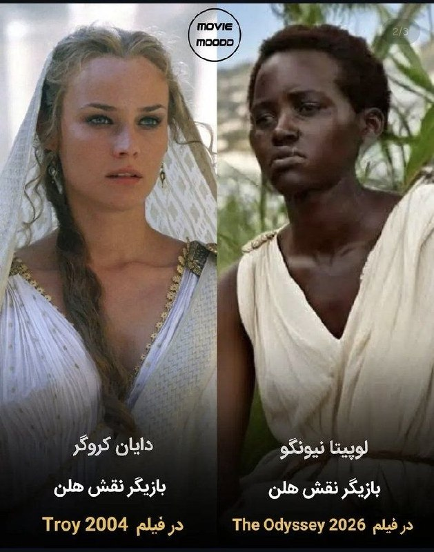

یعنی این فیلم The Odyssey که قراره بسازن مزخرف ترین فیلمی خواهد بود که تاحالا ساخته شده! نقش آشیل رو قراره یه زن تغییر جنسیت داده بازی کنه و نقش هلن رو قراره یه سیاه پوست لاغر.🥴 حتی به دول آشیل و رنگ پوست هلن هم رحم نگردن این چپهای کسخل @Dirty_Kids 👻

## Dirty_Kids — post 389514

بنیاد بین‌المللی رسانه‌های زنان (IWMF)، جایزه «شجاعت در خبرنگاری» رو داده به یک خبرنگار که اینترنت سفید داره.
قشنگ داریم یه جوک رو زندگی می‌کنیم

خواهران محمدی، خبرنگاران حوزه محور مقاومت، غزه و حومه.

@Dirty_Kids 👻

---
📅 بروزرسانی: 1405/02/25 20:45
---

## Dirty_Kids — post 389513

  <a href="telegram/content/Dirty_Kids_389513_1778865346.mp4" target="_blank">🎬 Download video</a>

سهمیه بندی حوری برای شهدا ! 🤣🤣🤣

ارزش دانلود ۱۰/۱۰

@Dirty_Kids 👻

## Dirty_Kids — post 389512

  <a href="telegram/content/Dirty_Kids_389512_1778865347.webm" target="_blank">🎬 Download video</a>

سنتکام رسماً تأیید کرد که حمله به مدرسه میناب توسط آمریکا صورت گرفته.

❌ این خبر که تو فضای مجازی داره دست به دست میشه، فیکه؛ سنتکام تأیید نکرده و ترامپ هم امروز گفت که هنوز داریم بررسی می‌کنیم.

@Dirty_Kids 👻

## Dirty_Kids — post 389511

✖️ سایت بین المللی bet120x 
✖️  
👍دارای مجوز رسمی Gambling Judge سوئد
👍       
💳شارژ حساب از طریق ارز و یووچر و پرمیوم ووچر 
💳تسویه حساب دلاری سریع 💊بیمه شرط میکس 
⚠️فروش شرط 
🔔ویرایش شرط                    
3️⃣
2️⃣ 
🎁20%هدیه واریز از طریق ارز و ووچر ┅━━━━━━━━━━━…

## Dirty_Kids — post 389510

  

✖️ سایت بین المللی bet120x 
✖️

 
👍دارای مجوز رسمی Gambling Judge سوئد
👍
     

💳شارژ حساب از طریق ارز و یووچر و پرمیوم ووچر

💳تسویه حساب دلاری سریع
💊بیمه شرط میکس

⚠️فروش شرط

🔔ویرایش شرط                    
3️⃣
2️⃣

🎁20%هدیه واریز از طریق ارز و ووچر
┅━━━━━━━━━━━

🎁 10%برگشت باخت به صورت روزانه

🎁 10%برگشت باخت به صورت هفتگی

🎁10%برگشت باخت به صورت ماهانه

💻ادرس ورود به سایت:
https://bet120x.com/fa/?btag=971470
➖➖➖➖➖
   
👈 آموزش واریز و برداشت دلاری
👉

🔪کانال اطلاع رسانی:
👇

✈️https://t.me/+1Wv5nGY_a54xNzlk

## Dirty_Kids — post 389505

این شما و این منتخب ژانر از کِی فهمیدین کسخلید توی توییتر :))

@Dirty_Kids 👻

## Dirty_Kids — post 389504

  <a href="telegram/content/Dirty_Kids_389504_1778865348.mp4" target="_blank">🎬 Download video</a>

مبارزه بانو هایده در برابر معین به کمک مدل Seedance 2.0 در سرویس PolloAI!

@Dirty_Kids 👻

## Dirty_Kids — post 389503

  <a href="telegram/content/Dirty_Kids_389503_1778865349.mp4" target="_blank">🎬 Download video</a>

بحران زیست‌محیطی در خلیج فارس در پی نشت نفت از جزیره مارو

@Dirty_Kids 👻

## Dirty_Kids — post 389502

  

🌪وقتی اینترنت طوفانیه... کافیه بادبان ها رو بکشی تا

⚫️با بالاترین کیفیت ممکن
⚡️ 

⚫️100 هزار تومان شارژ هدیه 
🎁

⚫️پایین ترین قیمت گیگی 250
🌐 

⚫️و ارائه پورسانت %10 در ازای هر معرفی
💼

بتونی یه اتصال پایدار با پشتیبانی 24 ساعته داشته باشی
🚀

بادبان راهتو باز می‌کنه
⛵️

G25

🛡@BadBan_VPN | کانال 

🤖@BadBan_VPNBot | ربات 

📞@BadBan_VPNSupport | پشتیبانی

---
📅 بروزرسانی: 1405/02/25 19:06
---

## exoupdate_news — post 60424

[UPDATE] [260515] Preview #EXO at Shopee Thailand Fansign

cr.onpict
*@exoljjang_ina*

## exoupdate_news — post 60423

  <a href="telegram/content/exoupdate_news_60423_1778859391.mp4" target="_blank">🎬 Download video</a>

[UPDATE] [260515] LAY INSTAGRAM LIVE <Record>

Ujian tidak bisa menentukan siapa dirimu, tetapi kita tetap perlu melewatinya🤣

@BAEK0FF
*@exoljjang_ina*

## exoupdate_news — post 60422

  <a href="telegram/content/exoupdate_news_60422_1778859394.mp4" target="_blank">🎬 Download video</a>

[UPDATE] [260515] Lay's Channel Instagram UPDATE

"Hai semuanya. Ada masalah dengan internet atau semacamnya. Mungkin koneksi internetnya bermasalah.
Jadi aku mau terbang. Aku akan terbang. Dan ya.
Aku mau istirahat sebentar. Eh, tidur siang.
Dan kalian tahu, nonton sesuatu.
Kalau kalian mau tidur, boleh tidur. Dan kalau kalian sedang bekerja, fokus saja pada pekerjaan kalian. Oke? Semoga hari kalian menyenangkan. Dan kalau aku sudah mendarat, aku mau beritahu kalian ya.

@YuXING1012
*@exoljjang_ina*

## exoupdate_news — post 60420

  <a href="telegram/content/exoupdate_news_60420_1778859397.mp4" target="_blank">🎬 Download video</a>

[UPDATE] [260515] Preview #SEHUN at Shopee Thailand Fansign

cr. mmiewmiewmiew
*@exoljjang_ina*

## exoupdate_news — post 60417

  <a href="telegram/content/exoupdate_news_60417_1778859399.mp4" target="_blank">🎬 Download video</a>

[UPDATE] [260515] Preview #CHANYEOL at Shopee Thailand Fansign

cr. mmiewmiewmiew
*@exoljjang_ina*

## exoupdate_news — post 60416

  <a href="telegram/content/exoupdate_news_60416_1778859401.mp4" target="_blank">🎬 Download video</a>

[UPDATE] [260515] Preview #EXO at Shopee Thailand Fansign

cr. tcnlu_
*@exoljjang_ina*

## exoupdate_news — post 60415

  <a href="telegram/content/exoupdate_news_60415_1778859404.mp4" target="_blank">🎬 Download video</a>

[UPDATE] [260515] LAY INSTAGRAM LIVE <Record>

"Aku tidak bisa menjadi suamimu, aku bisa menjadi Abang Lay-mu."

@YuXING1012
*@exoljjang_ina*

## exoupdate_news — post 60414

  <a href="telegram/content/exoupdate_news_60414_1778859407.mp4" target="_blank">🎬 Download video</a>

[UPDATE] [260515] Preview #KYUNGSOO at Shopee Thailand Fansign

*Kyungsoo kalah suit sama OP 🥹🫣😆

cr. mine_doki
*@exoljjang_ina*

## Dirty_Kids — post 389501

  <a href="telegram/content/Dirty_Kids_389501_1778859410.mp4" target="_blank">🎬 Download video</a>

نمیدونم کیه این پسره و چه برنامه‌ای هست ولی داره درست میگه، این اقلیت ۵درصدی رافضی ولایت‌به‌باسن برای اینکه بمونن راضین همرو بکشن

@Dirty_Kids 👻

## Dirty_Kids — post 389500

  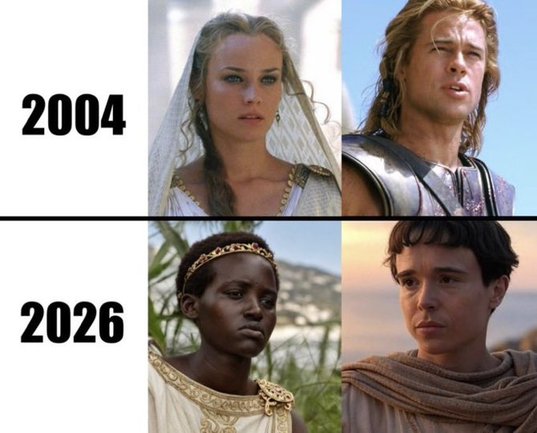

یعنی این فیلم The Odyssey که قراره بسازن مزخرف ترین فیلمی خواهد بود که تاحالا ساخته شده!
نقش آشیل رو قراره یه زن تغییر جنسیت داده بازی کنه و نقش هلن رو قراره یه سیاه پوست لاغر.🥴
حتی به دول آشیل و رنگ پوست هلن هم رحم نگردن این چپهای کسخل

@Dirty_Kids 👻

## Dirty_Kids — post 389498

یکی از پدرهای پویان مختاری هم پیدا شد

@Dirty_Kids 👻

## Dirty_Kids — post 389497

  <a href="telegram/content/Dirty_Kids_389497_1778859412.mp4" target="_blank">🎬 Download video</a>

کلا تو یه لیگ دیگه‌ست :)))

ترامپ در پاسخ به این سؤال که آیا درباره حملات سایبری علیه آمریکا با شی جین‌پینگ حرف زده یا نه:

'آره، بهش گفتم. اونم شروع کرد درباره کارایی که ما تو چین کردیم حرف زدن.
خب می‌دونی، هر کاری اونا بکنن ما هم می‌کنیم. ما هم حسابی ازشون جاسوسی می‌کنیم.
بهش گفتم ما یه عالمه کارها علیه شما می‌کنیم که اصلاً خبر ندارین.'

@Dirty_Kids 👻

## Dirty_Kids — post 389496

  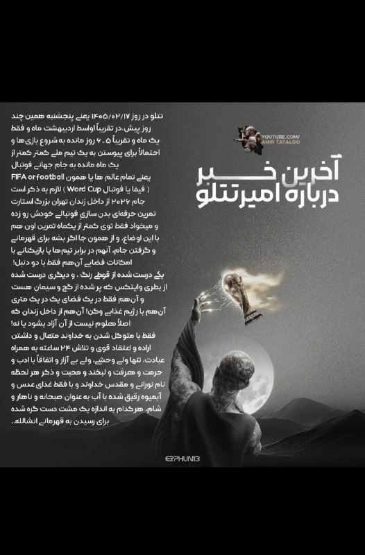

صفحه یوتیوب تتلو :
امیرخان درحالی که فقط یک ماه به شروع جام جهانی مونده، از تو زندان استارت تمرین‌هاش رو زده و میخواد عضو یه تیم ملی بشه تا تو این مسابقات شرکت کنه.

خودشم داخل قوطی رنگ و بطریِ وایتکس، گچ و سیمان ریخته و داره ازشون به عنوان دمبل استفاده می‌کنه.
ایشون تو یه فضای 1*1 داره تمرین میکنه و واسه صبحونه، ناهار و شام فقط عدسی و آب‌میوه میخوره!

@Dirty_Kids 👻

---
📅 بروزرسانی: 1405/02/25 16:48
---

## exoupdate_news — post 60413

  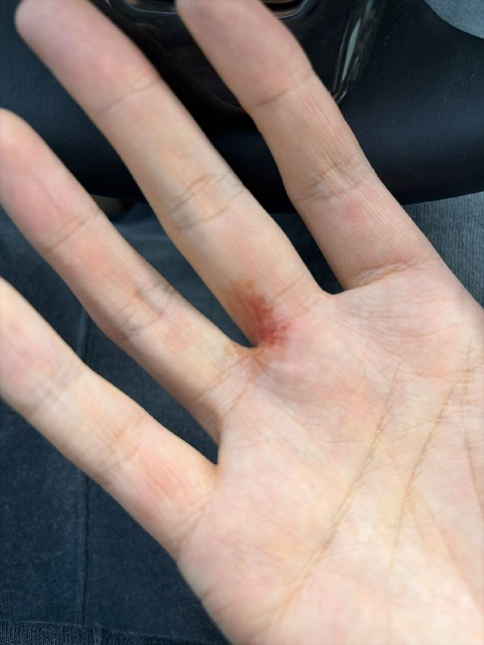

[UPDATE] [260515] BAEKHYUN BUBBLE UPDATE 🐶🫧 *latepost "Apa yang harus kubeli sebagai hadiah Hari Guru?…" "Ini sulit sekali… Aku keluar untuk membeli hadiah untuk guru vokal dan istrinya, tapi aku tersesat… Aku tidur lebih awal kemarin jadi kondisiku sedang…

## exoupdate_news — post 60412

[UPDATE] [260515] BAEKHYUN BUBBLE UPDATE 🐶🫧
*latepost

"Apa yang harus kubeli sebagai hadiah Hari Guru?…"
"Ini sulit sekali… Aku keluar untuk membeli hadiah untuk guru vokal dan istrinya, tapi aku tersesat… Aku tidur lebih awal kemarin jadi kondisiku sedang prima, tapi tiba-tiba energiku terkuras…"
"Kamu mungkin tidak begitu mengerti, kan?… Sulit sekali, ya?…"

engtrans : fourbaekpearl
*exoljjang_ina*

## exoupdate_news — post 60411

  

[UPDATE] [260515] EXO OFFICIAL SNS UPDATE #CHANYEOL

"#Memulai rentetan keberuntungan 🫧🧤"

https://www.instagram.com/p/DYWjfAoK7JQ/?igsh=YTZmMnFyb2ltYWwx

https://x.com/i/status/2055201662327992394
*@exoljjang_ina*

## exoupdate_news — post 60410

  

[UPDATE] [260515] EXO OFFICIAL SNS UPDATE #CHANYEOL

"Charlie Charlie, apakah kamu merasa segar? YES… | Seorang Idola 15 Tahun yang Memoles dan Menyinari Perusahaan Orang Lain"

youtu.be/eI5olXDx6ps

https://x.com/i/status/2055181653493047616
*@exoljjang_ina*

## exoupdate_news — post 60404

[UPDATE] [260515] ssu_mny (Fotografer EXO Season Greetings 2026) Instagram UPDATE

EXO 2026 SEASON‘S GREETINGS ‘Division Zero:EXO’

https://www.instagram.com/p/DYUX4CNmnM-/?igsh=MWs2YmY3NjJpaDRoNg==
*@exoljjang_ina*

## exoupdate_news — post 60394

[UPDATE] [260515] ssu_mny (Fotografer EXO Season Greetings 2026) Instagram UPDATE

EXO 2026 SEASON‘S GREETINGS ‘Division Zero:EXO’

https://www.instagram.com/p/DYUX4CNmnM-/?igsh=MWs2YmY3NjJpaDRoNg==
*@exoljjang_ina*

## Dirty_Kids — post 389495

  <a href="telegram/content/Dirty_Kids_389495_1778851126.mp4" target="_blank">🎬 Download video</a>

در ادامه‌ی مصاحبه‌ی جلو در توالتی ترامپ در راه بازگشت از چین:

خبرنگار: آیا تونستید تایید کنید که اون موشک [که به مدرسه‌ی میناب اصابت کرد] آمریکایی بوده؟

ترامپ: شما با کجا کار می‌کنید عزیزجان؟

خبرنگار: بی‌بی‌سی.

ترامپ: بی‌بی‌سی جعلی؟ تو گه بخور. منظورت همون جاکشاییه که با هوش مصنوعی دهن من حرف گذاشتند؟ همونا که از قول من بیانیه‌ای رو منتشر کردند که حالا خودشون اعتراف می‌کنن حقیقت نداشته؟ همون پوفیوزایی که کلمات وحشتناکی رو گذاشتن دهن من و بعد مجبور شدند اعتراف کنن که جعلی بوده؟
همون دیوثایی که الان به خاطر ۵ میلیار...


@Dirty_Kids 👻

## Dirty_Kids — post 389494

هر از چندگاهی مچ خودمو درحال ریلز دیدن میگیرم. بی پروای فقیر

@Dirty_Kids 👻

## Dirty_Kids — post 389493

ایران حتی تبریک تولدهامون‌ هم نفرینه
ایشالله خودت ۱۲۰ ساله بشی بی‌شرف

@Dirty_Kids 👻

## Dirty_Kids — post 389492

  <a href="telegram/content/Dirty_Kids_389492_1778851127.mp4" target="_blank">🎬 Download video</a>

آنلاین شاپا باز شروع کردن...

@Dirty_Kids 👻

## Dirty_Kids — post 389491

  <a href="https://t.me/Dirty_Kids/389491" target="_blank">📎 Download file</a>

✅ اپلیکیشن اندروید سایت جهانی دربی بت

💰اولین سایت جهانی با امکان شارژ و برداشت ریالی(کارت به کارت)

🔗 برای ورود فیلترشکن روی کشور مناسب قرار دهید مانند فنلاند و المان و....

😀Telegram Channel
👇
https://t.me/+bcynkEgSW2dlYTc0

## Dirty_Kids — post 389490

  

😤دنبال یه سایت شرط بندی بین المللی بودی که به ایرانیا خدمات بده؟!
⛔

👍دربی بت همون انتخاب  100%

💎ویژگی های سایت جهانی Derby Bet:

⬅️امکان شارژ امن با کارت بانکی

⬅️واریز اول دوبل شارژ می شوید(بونوس۱۰۰٪)

⬅️پر اپشن ترین سایت فعال در ایران

⬅️تسویه حساب کمتر از 5 دقیقه

⬅️برگشت بخشی از باخت به صورت هفتگی

🚨کد هدیه ثبت نام:GG007

⚠️برای دانلود اپلکیشن کلیک کنید
👉

🔔کانال دربی بت :

🪙https://t.me/+bcynkEgSW2dlYTc0

## Dirty_Kids — post 389489

  <a href="telegram/content/Dirty_Kids_389489_1778851129.mp4" target="_blank">🎬 Download video</a>

در مورد پروپوزال ایران:
ترامپ: جمله اولش رو که خوندم انداختمش دور!
خبرنگار: جمله اول چی بود؟
ترامپ: یه‌ چیز غیرقال قبول! ما نمیخوایم ایران غنی سازی کنه!!
خبرنگار: یعنی ۲۰ سال توقف غنی سازی کافی نیس؟
ترامپ: ۲۰ سال کافیه ولی باید واقعی باشه و تضمین بدن!

@Dirty_Kids 👻

## Dirty_Kids — post 389488

  

مجتبی خامنه‌ای به مناسبت روز بزرگداشت فردوسی، این پیام رو منتشر کرد:

همین که یک تازی راهزن بیابانگرد رافضی به ارزش‌های زبان و ادبیات فارسی اعتراف می‌کند می‌تواند جالب باشد.

@Dirty_Kids 👻

## Hearts2HeartsUpdateSM — post 23278

  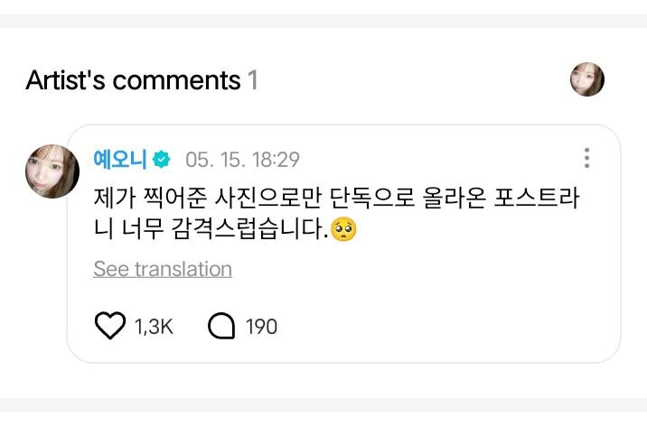

[260515] WEVERSE COMMENT

😊: I’m so touched that a post using only the photos I took was uploaded 🥺
───────
😊: Aku terharu banget karena ada postingan yang cuma pakai foto hasil jepretanku sendiri 🥺

🐝 [@Hearts2HeartsUpdateSM]

---
📅 بروزرسانی: 1405/02/25 15:04
---

## Dirty_Kids — post 389487

  

شاشیدم تو تار به تار سیبیلاتون.

@Dirty_Kids 👻

## Dirty_Kids — post 389486

  

قیمت جهانی استارلینک مینی با تخفیف به زیر ۲۰۰دلار (۳۶میلیون تومن) رسیده و پایین‌تر هم میاد. سایز دیشش هم اندازه‌ی یه کاغذ A4 هس و براحتی همه جا مخفی میشه و با وضعیت ایران هیچ رقمه نمیشه جلوی موج قاچاقش رو گرفت.

رویای آخوند برای کنترل بلند مدت اینترنت فقط یه توهمه.

@Dirty_Kids 👻

## Dirty_Kids — post 389485

  

🌪وقتی اینترنت طوفانیه... کافیه بادبان ها رو بکشی تا

⚫️با بالاترین کیفیت ممکن
⚡️ 

⚫️100 هزار تومان شارژ هدیه 
🎁

⚫️پایین ترین قیمت گیگی 250
🌐 

⚫️و ارائه پورسانت %10 در ازای هر معرفی
💼

بتونی یه اتصال پایدار با پشتیبانی 24 ساعته داشته باشی
🚀

بادبان راهتو باز می‌کنه
⛵️

R25

🛡@BadBan_VPN | کانال 

🤖@BadBan_VPNBot | ربات 

📞@BadBan_VPNSupport | پشتیبانی

## Hearts2HeartsUpdateSM — post 23272

[260515] #YUHA WEVERSE UPDATE

But I still like spring moreee 🌱

🐝 [@Hearts2HeartsUpdateSM]

## Hearts2HeartsUpdateSM — post 23271

  <a href="telegram/content/Hearts2HeartsUpdateSM_23271_1778844890.mp4" target="_blank">🎬 Download video</a>

[260515] #HEARTS2HEARTS SNS UPDATE

Summer, just wait for us

#Hearts2Hearts #하츠투하츠 #H2H

🐝 [@Hearts2HeartsUpdateSM]

---
📅 بروزرسانی: 1405/02/25 12:58
---

## exoupdate_news — post 60393

  <a href="telegram/content/exoupdate_news_60393_1778837330.mp4" target="_blank">🎬 Download video</a>

[UPDATE] [260515] Home Facial Pro Weibo UPDATE #BAEKHYUN

"Cuplikan di balik layar | Di mana tombol keluar untuk video ini? 🔁

Di antara pembukaan dan penutupan rana, kami diam-diam mengabadikan Baekhyun @INB100_BAEKHYUN yang fokus dan sungguh-sungguh . Klik pada video untuk melihat beberapa momen menyenangkan~"

https://m.weibo.cn/status/5298777229627261

*@exoljjang_ina*

## exoupdate_news — post 60387

[UPDATE] [260515] ssu_mny (Fotografer EXO Season Greetings 2026) Instagram UPDATE

EXO 2026 SEASON‘S GREETINGS ‘Division Zero:EXO’

https://www.instagram.com/p/DYUVUiPmiJQ/?igsh=c2R0eGpnaHJhZTk2
*@exoljjang_ina*

## exoupdate_news — post 60380

[UPDATE] [260515] ssu_mny (Fotografer EXO Season Greetings 2026) Instagram UPDATE

EXO 2026 SEASON‘S GREETINGS ‘Division Zero:EXO’

https://www.instagram.com/p/DYUVUiPmiJQ/?igsh=c2R0eGpnaHJhZTk2
*@exoljjang_ina*

## Dirty_Kids — post 389484

  

هیچ کودکی نباید اول قصه‌اش از کنار قبر پدرش شروع شود…
در ایران اما این سرنوشت خیلی از کودکان است.
#علیرضا_احمدی

@Dirty_Kids 👻

## Dirty_Kids — post 389483

  

پستِ خواهرِ جاویدنام سپهر ابراهیمی نشون میده که سپهر هم یه پادشاهی خواه بود ❤️
این انقلاب و پادشاهی خواها با خونشون به ثمر میرسونن.

@Dirty_Kids 👻

## Dirty_Kids — post 389482

  

زندگی تو ایران که استرس نداره بابا
ممد ۲۰ ساله:

@Dirty_Kids 👻

## Dirty_Kids — post 389481

کاش حداقل خودمون ریده بودیم تو زندگیمون. درس خوندیم، کار کردیم، زحمت کشیدیم و نهایتا دستاوردش چی بوده؟ کیرخر

@Dirty_Kids 👻

## Dirty_Kids — post 389480

  

امیدوارم برسه به دست ترامپ.
عمویم خریت بچه ‌شیعه:

@Dirty_Kids 👻

---
📅 بروزرسانی: 1405/02/25 09:50
---

## exoupdate_news — post 60374

[UPDATE] [260515] lay_studio SNS UPDATE

"Malam menyelimuti bahu, angin senja menerpa jubah. Di tengah langit berbintang dan lampu kota, Boss @layzhang perlahan menyingkap pesona dan kemegahan unik dari Timur."

#LAY #LayZhang

https://www.instagram.com/p/DYWI6iplKlq/?igsh=ODNsYjdlcHFtNW40

https://x.com/i/status/2055142573375930820
*@exoljjang_ina*

## exoupdate_news — post 60369

[UPDATE] [260515] lay_studio SNS UPDATE

"Malam menyelimuti bahu, angin senja menerpa jubah. Di tengah langit berbintang dan lampu kota, Boss @layzhang perlahan menyingkap pesona dan kemegahan unik dari Timur."

#LAY #LayZhang

https://www.instagram.com/p/DYWI6iplKlq/?igsh=ODNsYjdlcHFtNW40

https://x.com/i/status/2055142573375930820
*@exoljjang_ina*

---
📅 بروزرسانی: 1405/02/25 06:09
---

## exoupdate_news — post 60368

✨ *EXO SCHEDULE MEI 2026* ✨️

📆 2 - 3 MEI ✅️
📝 *EXO Planet 6: 'EXhOrizon' in Nagoya
⏰️ 16.00 WIB & 15.00 WIB

📆 4 MEI ✅️
📝 *BAEKHYUN* x HFP: Video Teaser <HomeFacialPro China ‘Enlighten your wish’ >
📝 *KAI* : No, But Really!
⏰️ 20.10 WIB
📺 SBS

📆 6 MEI ✅️
📝 *BAEKHYUN* Birthday 🥳🎂🎉
📝 *BAEKHYUN* x HFP: Official Announcement
ㄴ TVC Television Commercial Video Release
📝 *CHANYEOL* : Rising Eagles Full Match 4

📆 7 MEI ✅️
📝 *BAEKHYUN* x HFP: Berbagi tentang perawatan kulit
📝 *KAI* : Jeongwaja Ep. 121

📆 9 MEI ✅️
📝 *CHANYEOL* : Choi Crew Ep. 4
⏰️ 16.00 WIB

📆 9 - 10 MEI ✅️
📝 *EXO Planet 6: 'EXhOrizon' in Taipei
⏰️ 17.00 WIB & 15.00 WIB

📆 11 MEI ✅️
📝 *KAI* : No, But Really!
⏰️ 20.10 WIB
📺 SBS

📆 13 MEI ✅️
📝 *BAEKHYUN* x HFP: Wawancara di balik layar
📝 *CHANYEOL* : CHchanyeol Youtube 'Piknik sendirian'

📆 15 MEI
📝 *BAEKHYUN* x HFP: Konten bonus eksklusif (cuplikan blooper)
📝 *CHANYEOL* : 개운빨 premiere episode
📝 *EXO* : Shopee Thailand Fansign & Photo Event

📆 16 MEI
📝 *CHANYEOL* : Choi Crew Ep. 5
⏰️ 16.00 WIB

📆 16 - 17 MEI
📝 *EXO Planet 6: 'EXhOrizon' in Bangkok
⏰️ 18.00 WIB & 16.00 WIB

📆 18 MEI
📝 *KAI* : No, But Really!
⏰️ 20.10 WIB
📺 SBS

📆 20 MEI
📝 *CHANYEOL* : CHchanyeol Youtube 'Pendakian peringatan ulang tahun pertama'
📝 *CHANYEOL* : Rising Eagles Full Match 6
📝 *SUHO* : B-day Party 'To My First Love'
⏰️ 18.00 WIB

📆 21 MEI
📝 *KAI* : Jeongwaja Ep. 122

📆 22 MEI
📝 *SUHO* Birthday 🥳🎂🎉

📆 22 - 23 MEI
📝 *EXO Planet 6: 'EXhOrizon' in Macau
⏰️ 19.00 WIB & 18.00 WIB

📆 23 MEI
📝 *CHANYEOL* : Choi Crew Ep. 6
⏰️ 16.00 WIB

📆 24 MEI
📝 *EXO* Fansign 'Reverxe' in Macau by Xiaomang

📆 25 MEI
📝 *KAI* : No, But Really!
⏰️ 20.10 WIB
📺 SBS

📆 27 MEI
📝 *CHANYEOL* : CHchanyeol Youtube 'Blind Boxes'

📆 28 MEI
📝 *KAI* : Jeongwaja Ep. 124

📆 30 MEI
📝 *EXO* at MCOUNTDOWN

*Jadwal akan bertambah/berubah sesuai jadwal terbaru

*@exoljjang_ina*

## exoupdate_news — post 60366

[UPDATE] [260515] PREVIEW Airport #KAI Flight ICN ✈️ BKK

*Kai di bandara ICN menuju Bangkok, Thailand untuk acara fansign & foto offline dan konser EXhOrizon mereka.ᐟ ✈️🇹🇭

cr.onpict
*@exoljjang_ina*

## exoupdate_news — post 60365

  <a href="telegram/content/exoupdate_news_60365_1778812771.mp4" target="_blank">🎬 Download video</a>

[UPDATE] [260515] Sehun, Suho dan Chanyeol di bandara ICN menuju Bangkok, Thailand untuk acara fansign & foto offline dan konser Exhorizon mereka.ᐟ ✈️🇹🇭

@.milkteus
*@exoljjang_ina*

---
📅 بروزرسانی: 1405/02/25 03:23
---

هیچ پیام جدیدی در این بروزرسانی ارسال نشد.

---
📅 بروزرسانی: 1405/02/25 02:23
---

## Dirty_Kids — post 389479

  <a href="telegram/content/Dirty_Kids_389479_1778799205.webm" target="_blank">🎬 Download video</a>

☢️خفن ترین و‌ قدیمی ترین  انالیزور  ایران ینی دکتر بت 
👍 
🔴هیچ سایت بتی دوست نداره شما کانال دکتر بت رو پیدا کنین چون خیلی سود میکنید🤷‍♂ رایگان بهترین شرط هارو براتون میذاره حتی هزار تومن هم دریافت نمیکنه روزانه میتونی از پیش بینی فوتبال باهاش پول در بیاری…

## Dirty_Kids — post 389478

  <a href="telegram/content/Dirty_Kids_389478_1778799206.webm" target="_blank">🎬 Download video</a>

☢️خفن ترین و‌ قدیمی ترین  انالیزور  ایران ینی دکتر بت 
👍

🔴هیچ سایت بتی دوست نداره شما کانال دکتر بت رو پیدا کنین چون خیلی سود میکنید🤷‍♂

رایگان بهترین شرط هارو براتون میذاره
حتی هزار تومن هم دریافت نمیکنه
روزانه میتونی از پیش بینی فوتبال باهاش پول در بیاری 👌
A24
اگ اهل پیش بینی فوتبالی این کانال اصلا از دست ندین👇

✅https://t.me/+4_ADqwB9e-QwYjlk

✅https://t.me/+4_ADqwB9e-QwYjlk

## Dirty_Kids — post 389477

  

#بخوابیم

@Dirty_Kids 👻

## Dirty_Kids — post 389476

قضیه السیسی اگه نمیدونی این ویدیو کمکت میکنه

@Dirty_Kids 👻

## Dirty_Kids — post 389475

  

آیفونیا با کانفیگ پولی در حال خوندن پستای اندرویدیا که با وپن شیر 🌞 وصل شدن:

@Dirty_Kids 👻

## Dirty_Kids — post 389474

  <a href="telegram/content/Dirty_Kids_389474_1778799207.mp4" target="_blank">🎬 Download video</a>

🎙️خبرنگار : امیرعلی چرا اومدی تجمع؟
🧑امیرعلی : به عشق رهبر

🎙️خبرنگار : امیرعلی، مامان و بابات مجبورت کردن که بیای تجمعات؟

🧑امیرعلی : آره

@Dirty_Kids 👻

## Dirty_Kids — post 389473

  

کصمادرتون…
نسلتون رو ✌🏽 بار گائیدم…

@Dirty_Kids 👻

## Dirty_Kids — post 389472

  

تو خیابون حل اشکال ریاضی میزارن بعد رتبه یک کنکور رو اعدام میکنن.
اینجا، ایران جان..

@Dirty_Kids 👻

## Dirty_Kids — post 389471

‏تو آسانسور از دختره پرسیدم کدوم طبقه میری ؟
گفت : فرقی نمیکنه.

@Dirty_Kids 👻

## Dirty_Kids — post 389470

  

ملانیا واقعا خوشتیپه

@Dirty_Kids 👻

---
📅 بروزرسانی: 1405/02/25 01:23
---

هیچ پیام جدیدی در این بروزرسانی ارسال نشد.

---
📅 بروزرسانی: 1405/02/25 00:15
---

## Dirty_Kids — post 389469

  <a href="telegram/content/Dirty_Kids_389469_1778791513.mp4" target="_blank">🎬 Download video</a>

چون دل‌تون برای سخنگوی اسکل الانبیا تنگ شده میدونم

@Dirty_Kids 👻

## Dirty_Kids — post 389468

  

اره داداش، امریکا تایوان رو میده به چین و ایران رو ازش میگیره.

@Dirty_Kids 👻

---
📅 بروزرسانی: 1405/02/24 22:36
---

## Dirty_Kids — post 389467

  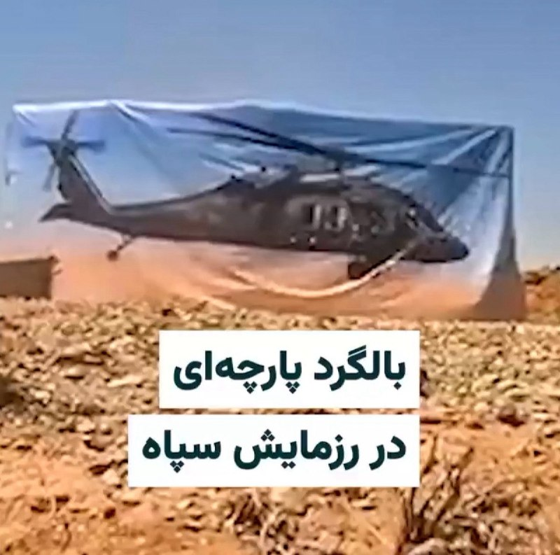

آخرین ورژن خفت و خواری بچه‌شیعه:
رزمایش گذاشتن، هلی‌کوپتر نداشتن، بنرشو چاپ کردن گذاشتن اون وسط.

@Dirty_Kids 👻

## Dirty_Kids — post 389466

  

اصلی ترین سوالی که برای من پیش میاد که چرا تو همون ایران زیر کیر آخوند نمیخوابید ؟؟ چرا مهاجرت میکنید از راه دور برای آخوند دهنی میزنید ؟؟

این جک و جنده آزادی‌رو دوست دارن ولی اعتقاد دارن ملت ایران لیاقت ندارن فقط برای خودشون خوبه

@Dirty_Kids 👻

## Dirty_Kids — post 389465

  <a href="telegram/content/Dirty_Kids_389465_1778785586.mp4" target="_blank">🎬 Download video</a>

هنوز که هنوزه این ویدئو از درگیری چندتا ایرانی تو جاده ساحلیِ چالوس تو پیج‌های خارجی داره دست به دست میشه و تو اکسپلوره؛

@Dirty_Kids 👻

## Dirty_Kids — post 389464

  

خبرگزاری دانشجو : شما فقط نحوه دست دادن رئیس‌جمهور چین با پرفسور رئیسی و ترامپ رو مقایسه کنی، متوجه قدرت ایران میشید... +کسخلیت و کونده‌پروگری اینا حدی نداره :))))) چین فروختتشون توافق کرده با امریکا استقبال بی نظیر کردن از ترامپ بعد رئیسی گوزو ۶ کلاسه‌رو…

## Dirty_Kids — post 389463

  <a href="telegram/content/Dirty_Kids_389463_1778785588.mp4" target="_blank">🎬 Download video</a>

خبرگزاری دانشجو :
شما فقط نحوه دست دادن رئیس‌جمهور چین با پرفسور رئیسی و ترامپ رو مقایسه کنی، متوجه قدرت ایران میشید...

+کسخلیت و کونده‌پروگری اینا حدی نداره :)))))
چین فروختتشون توافق کرده با امریکا
استقبال بی نظیر کردن از ترامپ
بعد رئیسی گوزو ۶ کلاسه‌رو همه میریدن بهش از پوتین بگیر تا شی دارن مقایسه میکنن


@Dirty_Kids 👻

## Dirty_Kids — post 389462

  

رسایی؛ نماینده‌ی مجلس:

دولت قصد داره میزان سهمیه ماهانه بنزین ۱۵۰۰ تومنی و ۳۰۰۰ تومنی رو کاهش بده و قیمت بنزین ۵۰۰۰ تومنی رو هم به ۲۰۰۰۰ تومن برسونه.

@Dirty_Kids 👻

---
📅 بروزرسانی: 1405/02/24 20:39
---

## Dirty_Kids — post 389458

ده‌هزار تا عکس داره یکی از یکی زیباتر

@Dirty_Kids 👻

## Dirty_Kids — post 389456

ریدم=)))))))))

@Dirty_Kids 👻

## Dirty_Kids — post 389455

✖️ سایت بین المللی bet120x 
✖️  
👍دارای مجوز رسمی Gambling Judge سوئد
👍       
💳شارژ حساب از طریق ارز و یووچر و پرمیوم ووچر 
💳تسویه حساب دلاری سریع 💊بیمه شرط میکس 
⚠️فروش شرط 
🔔ویرایش شرط                    
3️⃣
2️⃣ 
🎁20%هدیه واریز از طریق ارز و ووچر ┅━━━━━━━━━━━…

## Dirty_Kids — post 389454

  

✖️ سایت بین المللی bet120x 
✖️

 
👍دارای مجوز رسمی Gambling Judge سوئد
👍
     

💳شارژ حساب از طریق ارز و یووچر و پرمیوم ووچر

💳تسویه حساب دلاری سریع
💊بیمه شرط میکس

⚠️فروش شرط

🔔ویرایش شرط                    
3️⃣
2️⃣

🎁20%هدیه واریز از طریق ارز و ووچر
┅━━━━━━━━━━━

🎁 10%برگشت باخت به صورت روزانه

🎁 10%برگشت باخت به صورت هفتگی

🎁10%برگشت باخت به صورت ماهانه

💻ادرس ورود به سایت:
https://bet120x.com/fa/?btag=971470
➖➖➖➖➖
   
👈 آموزش واریز و برداشت دلاری
👉

🔪کانال اطلاع رسانی:
👇

✈️https://t.me/+1Wv5nGY_a54xNzlk

## Dirty_Kids — post 389453

  

گیر چه عقب مونده‌هایی افتادیم

ننگ ۵۰۰ ساله روحانیت رو از تاریخ ایران پاک باید کنیم

@Dirty_Kids 👻

## Dirty_Kids — post 389452

  <a href="telegram/content/Dirty_Kids_389452_1778778588.mp4" target="_blank">🎬 Download video</a>

هنوز رد خونت روشه ...
#پرهام_آقامحمدی

@Dirty_Kids 👻

## Dirty_Kids — post 389451

  

🌪وقتی اینترنت طوفانیه... کافیه بادبان ها رو بکشی تا

⚫️با بالاترین کیفیت ممکن
⚡️ 

⚫️100 هزار تومان شارژ هدیه 
🎁

⚫️پایین ترین قیمت گیگی 250
🌐 

⚫️و ارائه پورسانت %10 در ازای هر معرفی
💼

بتونی یه اتصال پایدار با پشتیبانی 24 ساعته داشته باشی
🚀

بادبان راهتو باز می‌کنه
⛵️

G24

🛡@BadBan_VPN | کانال 

🤖@BadBan_VPNBot | ربات 

📞@BadBan_VPNSupport | پشتیبانی

## Dirty_Kids — post 389450

  <a href="telegram/content/Dirty_Kids_389450_1778778590.mp4" target="_blank">🎬 Download video</a>

وضعیت دیشبِ خیابون فرشته تهران:
دعوا سر دختر

طهران الان قسمت بندی شده
یه گوشه حی‌در حی‌در میکنن عرزشیا هپی بشن، یه گوشه پروپاگاندا، یجا برای بچه پولدارا و...

@Dirty_Kids 👻

## Dirty_Kids — post 389449

  

‏از روزی که ‎#رضاشاه_کبیر سر از خاک بیرون آورد جمهوری اسهالی روی خوش ندید.

@Dirty_Kids 👻

## Dirty_Kids — post 389448

ShirOKhorshid-2026.05.14.apk

## Dirty_Kids — post 389447

  <a href="telegram/content/Dirty_Kids_389447_1778778592.mp4" target="_blank">🎬 Download video</a>

مراد؛ ویروس هانتا 😂🤌⁩⁩

@Dirty_Kids 👻

## Dirty_Kids — post 389446

  <a href="https://t.me/Dirty_Kids/389446" target="_blank">📎 Download file</a>

دقایقی قبل این اپلیکیشن بنام "شیر و خورشید" که نسخه تغییر یافته سایفون هستش تو تلگرام درحال وایرال شدنه و میگن خیلی خوب کار میکنه.

مهم: اگر این نسخه رو نصب کنید دیگه دردسر ستاپ کردن MITM و... ندارید!
این نسخه حدودا یک ساعت پیش توسط برنامه‌نویس شیر و خورشید آپدیت شد و به راحتی می‌تونید طبق این آموزش بهش وصل بشید:
1- وارد اپلیکیشن شیر و خورشید(آخرین نسخه که امروز منتشر شده) می‌شید
2- وارد بخش Options میشید از نوار بالا
3- روی More Options کلیک میکنید
4- گزینه‌ی Connection Protocol رو قرار میدید روی CDN Fronting
5- میرید و عادی کانکت میشید و به راحتی وصل میشه.

+ من تست نکردم ولی دیدم میگن جوابه

@Dirty_Kids 👻

---
📅 بروزرسانی: 1405/02/24 18:35
---

## exoupdate_news — post 60364

[UPDATE] [260514] lay_studio SNS UPDATE

" Bos @layzhang Seri Vlog Mini Cannes 📷
Setelah dia bertemu seekor angsa besar di tepi pantai, cerita pun terungkap! "

#LAY #LayZhang

https://www.instagram.com/reel/DYUjozrgcWE/?igsh=Z2Fnd2NzaTMxN2dl

https://x.com/i/status/2054922386500427880
*@exoljjang_ina*

## exoupdate_news — post 60363

  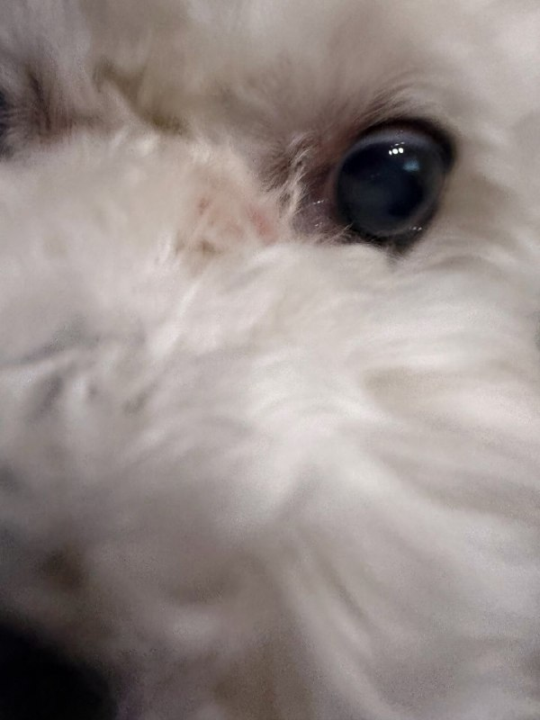

[UPDATE] [260514] SEHUN BUBBLE UPDATE 🐥🫧 “Nikmati makan malam yang lezat” “Aku akan berolahraga dan kemudian makan malam bersama keluargaku setelahnya” engtrans: xunhuas *@exoljjang_ina*

## Dirty_Kids — post 389445

  <a href="telegram/content/Dirty_Kids_389445_1778771124.webm" target="_blank">🎬 Download video</a>

🎶 موزیک - کتلت تنگسیری

@Dirty_Kids 👻

## Dirty_Kids — post 389444

  <a href="telegram/content/Dirty_Kids_389444_1778771125.mp4" target="_blank">🎬 Download video</a>

موزیک ویدیو کتلت تنگسیری

ارزش دانلود بالا، انرژی‌بخش و شاد

حجمش رو تا جایی‌که میشد آوردم پایین
موزیک خالیشم براتون پایین گذاشتم که حجمش خیلی کمتره

@Dirty_Kids 👻

## Dirty_Kids — post 389443

  <a href="telegram/content/Dirty_Kids_389443_1778771125.mp4" target="_blank">🎬 Download video</a>

جو خونه مکرون
بعد از قضیه گلشیفته

@Dirty_Kids 👻

## Dirty_Kids — post 389442

  <a href="telegram/content/Dirty_Kids_389442_1778771127.mp4" target="_blank">🎬 Download video</a>

مصاحبه‌ی بسیار مهمی از عموی خوبم اسکات بسنت وزیر خزانه‌داری آمریکا با شبکه‌ی CNBC که گزارش مختصری از وضعیت روافض هزارپدر می‌ده:

«چیزی که ما شاهدش هستیم اینه که تأسیسات بارگیری نفت روافض که اصلی‌ترین تأسیسات بارگیری نفت‌شونه، مجموعه‌ایه به نام جزیره خارک.

ما رصد کردیم و دیدیم که در سه روز گذشته هیچ بارگیری نفتی صورت نگرفته. ما معتقدیم که مخازن ذخیره‌ی نفت رژیم قحبه‌زاده پر شده.

هیچ کشتی‌ای‌ از اونجا خارج نمی‌شه و هیچ کشتی‌‌ای وارد نمی‌شه، بنابراین رژیم پدرخراب رافضی نمی‌تونه نفتش رو روی آب [در تانکرها] ذخیره کنه.
بنابراین رژیم هزارپدر شروع به متوقف کردن تولید نفت خواهد کرد.
ما از طریق تصاویر ماهواره‌ای می‌بینیم که این اتفاق در حال رخ دادنه.

اما مهم‌تر از همه‌ی این حرف‌ها اینه که این یک رژیم شیطانی مادرهزارتختخوابیه.
روافض جنایتکار تا اینجای سال جاری ۳۰ یا ۴۰ هزار نفر رو کشتن و اعدام کردن ‌ که خیلی از این معترضان مسالمت‌جو بودن‌. پس، با چنین رژیم مادرخر...



@Dirty_Kids 👻

## Dirty_Kids — post 389441

  <a href="telegram/content/Dirty_Kids_389441_1778771129.mp4" target="_blank">🎬 Download video</a>

شی جین‌پینگ، رئیس‌جمهور چین در دیدار با ترامپ رئیس‌جمهور آمريکا:

دو کشور ما باید شریک باشند، نه رقیب. مردم چین و ایالات متحده هر دو ملت‌های بزرگی هستند. تحقق احیای بزرگی ملت چین و عظمت دوباره آمریکا می‌تواند همزمان پیش برود. ما می‌توانیم به موفقیت یکدیگر کمک کنیم و رفاه کل جهان را ارتقا دهیم.

@Dirty_Kids 👻

## Dirty_Kids — post 389437

ترامپ تو چین یه جور داره رفتار میکنه که انگار اون میزبانه:

@Dirty_Kids 👻

## Dirty_Kids — post 389436

  <a href="telegram/content/Dirty_Kids_389436_1778771131.mp4" target="_blank">🎬 Download video</a>

این چه سمی بود دیدم 😂🔞

@Dirty_Kids 👻

## Hearts2HeartsUpdateSM — post 23270

  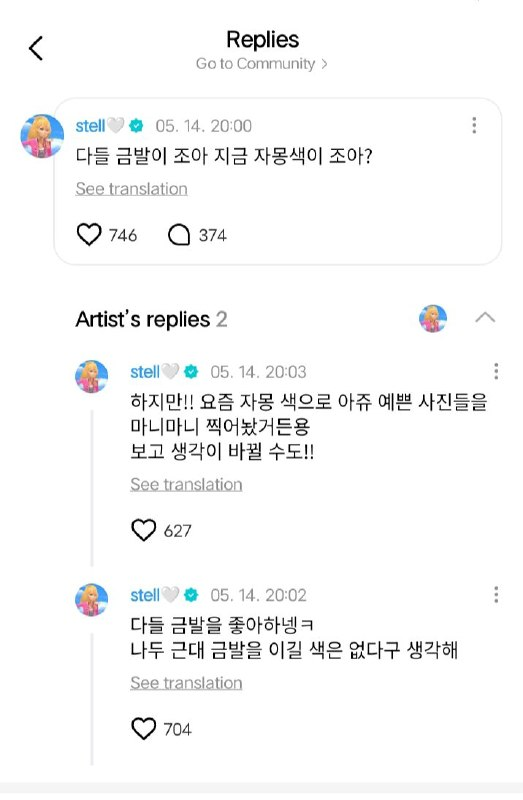

[260514] WEVERSE REPLY

🧁: Do you all prefer blonde hair or the grapefruit-colored hair right now?
🧁: Seems like everyone likes blonde hairㅋㅋ
I also think there’s no color that can beat blonde.
🧁: But!! Recently I took looots of really pretty photos with the grapefruit color though.
You might change your mind after seeing them!!

───────

🧁: Kalian lebih suka rambut pirang atau warna grapefruit yang sekarang?
🧁: Kayaknya semua orang suka rambut pirang yaㅋㅋ
Aku juga sebenarnya mikir nggak ada warna yang bisa ngalahin pirang.
🧁: Tapi!! Akhir-akhir ini aku ngambil banyaaak banget foto cantik dengan warna grapefruit ini.
Kalian mungkin bisa berubah pikiran setelah lihat nanti!!

🐝 [@Hearts2HeartsUpdateSM]

## Hearts2HeartsUpdateSM — post 23267

[260514] #STELLA WEVERSE UPDATE

When I was blonde 💛

🐝 [@Hearts2HeartsUpdateSM]

## Hearts2HeartsUpdateSM — post 23262

[260514] #YE_ON MEMBERSHIP UPDATE

1. Ye-on Hermit Crab
2, 3. Meow? 🐱 (just the vibe I feel matches the pics...?)
3. I love milk tea
4. Mozzarella cheese and strawberry jam i had at the restaurant 🍓

⚠️ DON’T REPOST ⚠️

🐝 [@Hearts2HeartsUpdateSM]

---
📅 بروزرسانی: 1405/02/24 15:49
---

## Dirty_Kids — post 389435

  

دقیقا وقتی فکر می‌کنی جمهوری اسلامی تپه نریده باقی نذاشته، همون لحظه یه تپه جدید می‌سازه و میره سرش میرینه.
فقط مونده بود برن از امارات کشتی بدزدن فرار کنن، که اونم گویا حاصل شد.

@Dirty_Kids 👻

## Dirty_Kids — post 389434

  <a href="https://t.me/Dirty_Kids/389434" target="_blank">📎 Download file</a>

✅ اپلیکیشن اندروید سایت جهانی دربی بت

💰اولین سایت جهانی با امکان شارژ و برداشت ریالی(کارت به کارت)

🔗 برای ورود فیلترشکن روی کشور مناسب قرار دهید مانند فنلاند و المان و....

😀Telegram Channel
👇
https://t.me/+bcynkEgSW2dlYTc0

## Dirty_Kids — post 389433

  

😤دنبال یه سایت شرط بندی بین المللی بودی که به ایرانیا خدمات بده؟!
⛔

👍دربی بت همون انتخاب  100%

💎ویژگی های سایت جهانی Derby Bet:

⬅️امکان شارژ امن با کارت بانکی

⬅️واریز اول دوبل شارژ می شوید(بونوس۱۰۰٪)

⬅️پر اپشن ترین سایت فعال در ایران

⬅️تسویه حساب کمتر از 5 دقیقه

⬅️برگشت بخشی از باخت به صورت هفتگی

🚨کد هدیه ثبت نام:GG007

⚠️برای دانلود اپلکیشن کلیک کنید
👉

🔔کانال دربی بت :

🪙https://t.me/+bcynkEgSW2dlYTc0

## Dirty_Kids — post 389432

سختی زبان چینی همینقدر بگم که اگه یکم تن صداتو بالا پایین کنی معنی کلمه از توت‌فرنگی به خوارتو گاییدم تغییر می‌کنه.

@Dirty_Kids 👻

## Dirty_Kids — post 389431

  <a href="telegram/content/Dirty_Kids_389431_1778761142.mp4" target="_blank">🎬 Download video</a>

شراب چینی ایلان ماسکو کصخل کرده، هر کی میاد باهاش عکس بگیره شکلک در میاره 😂

@Dirty_Kids 👻

## Hearts2HeartsUpdateSM — post 23261

  

Welcome to LA~ 하늘이 완전 파란색이에요⋆☀︎.(˶ᵔ ᵕ ᵔ˶) | Hearts2Hearts 하츠투하츠 Our Days in USA BH2ND #3 LA

youtu.be/LZZ6cV8PdWg

#Hearts2Hearts #하츠투하츠 #H2H
#H2HFANMEETING #HEARTS2HOUSE_LA
#BH2ND

🐝 [@Hearts2HeartsUpdateSM]

---
📅 بروزرسانی: 1405/02/24 14:12
---

## exoupdate_news — post 60362

[UPDATE] [260514] SEHUN BUBBLE UPDATE 🐥🫧 03:42 KST “have sweet dreams” *@exoljjang_ina*

## exoupdate_news — post 60361

  

[UPDATE] [260514] #KYUNGSOO

tvN Friday Anchor Variety <Kong Kong Series (New)>

Tayang pukul 20.40, Tayang Perdana Juni, 6 Episode

Kembalinya serial dokumenter komedi nyata yang terpercaya <Kong Kong>! Kali ini, di sebuah peternakan! Petualangan trio sahabat sejati Lee Kwang-soo × Kim Woo-bin × Do Kyung-soo di Pulau Jeju.

@.Doh_KyungSooSoo
*@exoljjang_ina*

## Dirty_Kids — post 389430

  <a href="telegram/content/Dirty_Kids_389430_1778755348.mp4" target="_blank">🎬 Download video</a>

وقتی از عمو «مارک‌روبیو» حرف می‌زنیم، در واقع داریم از این تفاوت‌هاش با سایر موجودات عالم حرف می‌زنیم،

شما ببین تنها کسیه که این‌طور کنجکاوانه و با شوق و ذوق به سقف تزئینات تالار بزرگ خلق کشور قرمدنگ چین نگاه می‌کنه و اشاره می‌کنه بقیه هم ببینن،

چین قرمساقی که در سال ۲۰۲۰ دو بار عمو مارک روبیو رو که در اون زمان سناتور جمهوری‌خواه ایالت فلوریدا بود رو تحریم کرد، [ممنوعیت ورود خودش و خانواده‌اش به چین و هنگ‌کنگ و مسدود کردن دارایی‌های احتمالی در چین که البته عمو هیچ دارایی در چین نداشت]

سر چی؟
چون عموی آگاه و اندیشمندم، این محمدعلی‌فروغی زمانه‌ی آمریکایی‌ها، از چین قرمساق در قضیه‌ی سین‌کیانگ و اویغورها و هنگ‌کنگ‌انتقاد شدید کرده بود.


@Dirty_Kids 👻

## Dirty_Kids — post 389428

  <a href="telegram/content/Dirty_Kids_389428_1778755349.mp4" target="_blank">🎬 Download video</a>

و در این میان ایلان پیش‌فعال

روی پله‌ها یک دور هم دور خودش چرخید و از اطراف فیلم گرفت!! :))))

@Dirty_Kids 👻

## Dirty_Kids — post 389427

  

🌪وقتی اینترنت طوفانیه... کافیه بادبان ها رو بکشی تا

⚫️با بالاترین کیفیت ممکن
⚡️ 

⚫️100 هزار تومان شارژ هدیه 
🎁

⚫️پایین ترین قیمت گیگی 250
🌐 

⚫️و ارائه پورسانت %10 در ازای هر معرفی
💼

بتونی یه اتصال پایدار با پشتیبانی 24 ساعته داشته باشی
🚀

بادبان راهتو باز می‌کنه
⛵️

R24

🛡@BadBan_VPN | کانال 

🤖@BadBan_VPNBot | ربات 

📞@BadBan_VPNSupport | پشتیبانی

## Dirty_Kids — post 389426

  

😂😂😂😂

@Dirty_Kids 👻

## Dirty_Kids — post 389425

  <a href="telegram/content/Dirty_Kids_389425_1778755351.mp4" target="_blank">🎬 Download video</a>

جنگ آمریکا و چین موقع دست دادن؛

ترامپ به سمت شی رفت، دست دادن و بعد جفت طرف سعی داشتن دست‌ِ طرف مقابل رو به سمت خودشون بِکشن که این صحنه خلق شد:

@Dirty_Kids 👻

## Dirty_Kids — post 389424

  

لاشیا فهمیدن ما عرقو با دوغ میخوریم

@Dirty_Kids 👻

## Dirty_Kids — post 389423

  

عکس پروفایل معلمای ادبیات

@Dirty_Kids 👻

## Hearts2HeartsUpdateSM — post 23259

[260514] WEVERSE REPLY

🩵: Yuna always wants to win, but never actually wins.
🌻: What made you feel that way?

🩵: You’re seriously super cute too.
🌻: These days I really want to become even cuter.

───────

🩵: Yuna selalu pengen menang, tapi nggak pernah benar-benar menang.
🌻: Emang dari mana kamu bisa ngerasa gitu?

🩵: Kamu juga lucunya nggak main-main.
🌻: Akhir-akhir ini aku pengen jadi makin imut banget.

🐝 [@Hearts2HeartsUpdateSM]

## Hearts2HeartsUpdateSM — post 23257

[260514] WEVERSE REPLY

🍓: Photo by the maknae~
😊: Yes.
🍓: Ah!!!!!!!!!!!!!!!!!!!!!
😊: Hehe, so it was a photo taken by me.
🍓: Cutie.
😊: 😘🍓

───────

🍓: Foto by maknae~
😊: Iya.
🍓: Ah!!!!!!!!!!!!!!!!!!!!!
😊: Hehe, jadi itu foto yang aku ambilin ya.
🍓: Lucuu.
😊: 😘🍓

🐝 [@Hearts2HeartsUpdateSM]

## Hearts2HeartsUpdateSM — post 23256

[260514] #JUUN WEVERSE UPDATE Jueun’s Q&A time 🐝 [@Hearts2HeartsUpdateSM]

## Hearts2HeartsUpdateSM — post 23255

[260514] #JUUN WEVERSE UPDATE Jueun’s Q&A time 🐝 [@Hearts2HeartsUpdateSM]

## Hearts2HeartsUpdateSM — post 23246

[260514] #JIWOO WEVERSE UPDATE

Do you want to eat together?

🐝 [@Hearts2HeartsUpdateSM]

## Hearts2HeartsUpdateSM — post 23245

[260514] #JUUN WEVERSE UPDATE Jueun’s Q&A time 🐝 [@Hearts2HeartsUpdateSM]

## Hearts2HeartsUpdateSM — post 23244

  

[INFO]

#HEARTS2HEARTS will attend the K-EXPO INKIGAYO in Paris 🇫🇷

📅 June 17, 2026
📍 Palais des Congrès de Paris, France.

Cr. H2H_INA

🐝 [@Hearts2HeartsUpdateSM]

## Hearts2HeartsUpdateSM — post 23243

  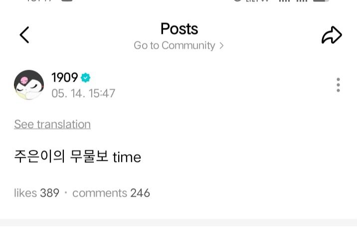

[260514] #JUUN WEVERSE UPDATE

Jueun’s Q&A time

🐝 [@Hearts2HeartsUpdateSM]

## Hearts2HeartsUpdateSM — post 23242

  <a href="telegram/content/Hearts2HeartsUpdateSM_23242_1778755356.mp4" target="_blank">🎬 Download video</a>

[260514] #HEARTS2HEARTS SNS UPDATE

Trying to walk🚶..

#Hearts2Hearts #하츠투하츠 #H2H #A_NA #에이나

🐝 [@Hearts2HeartsUpdateSM]

---
📅 بروزرسانی: 1405/02/24 11:50
---

## exoupdate_news — post 60353

[UPDATE] [260514] lay_studio SNS UPDATE

"Sinar matahari membeku dalam bingkai, angin laut membuka jalan.
Dari panggung ke layar perak global, @layzhang tetap setia pada kesempurnaannya.
Berakar pada warisan Timur, ia menjelajahi dunia dengan anggun."

#LAY #LayZhang

https://www.instagram.com/p/DYTtI6ulHL4/?igsh=ZWUzYzQ1YmV5OG41

https://x.com/i/status/2054799798436552943
*@exoljjang_ina*

## Dirty_Kids — post 389422

جدی پیک می تر از این جنده های حجابی تو دانشگاه وجود نداره، یارو سال اول کارشناسی کامپیوتره بعد استیکر زده رو لپ تاپش LEAVE ME ALONE IM CODING، بیا برو کیرم تو کدت شد

@Dirty_Kids 👻

## Dirty_Kids — post 389421

  <a href="telegram/content/Dirty_Kids_389421_1778746818.mp4" target="_blank">🎬 Download video</a>

پلیس شریف دانمارک vs طرفداران تروریسم جهانی

@Dirty_Kids 👻

## Dirty_Kids — post 389420

  

مانوک خدابخشیان: "فعالیتی که برای براندازی پهلوی سوم وجود داره، برای براندازی رژیم وجود نداره. همه تلاش می‌کنند که این شاهزاده پهلوی به ایران برنگرده‌."
روحت شاد عمومانوک

@Dirty_Kids 👻

## Dirty_Kids — post 389416

  <a href="telegram/content/Dirty_Kids_389416_1778746819.mp4" target="_blank">🎬 Download video</a>

#تکمیلی
یه پسره حدود 2 میلیون دلار هزینه کرده تا آلیس رزنبلوم | Alice Rosenblum دختر 19 ساله آمریکایی که مدل اونلی‌فنزه رو از نزدیک ببینه؛

پسره تا رسید بهش گفت چاق‌تر از عکساتی و من روزی 3 بار باهات خودارضایی می‌کنم...

تهشم فقط به دختره دست داد که آلیس چندشش شد و گفت اگه میشه بندازینش بیرون چون داره من رو می‌ترسونه!

@Dirty_Kids 👻

---
📅 بروزرسانی: 1405/02/24 09:04
---

## exoupdate_news — post 60352

  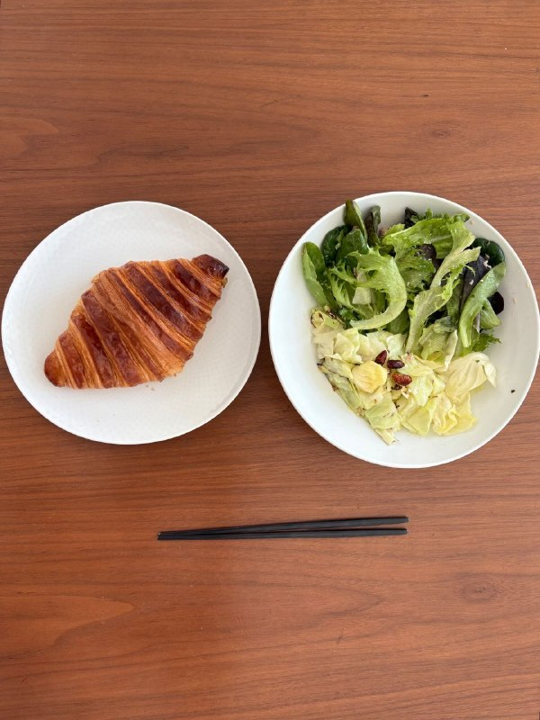

[UPDATE] [260514] CHEN BUBBLE UPDATE 🦖🫧

"📸"
"Makanlah sesuatu yang lezat hari ini!"
Semoga harimu menyenangkan ⭐️"

engtrans: daebubble
*@exoljjang_ina*

## Hearts2HeartsUpdateSM — post 23241

  <a href="telegram/content/Hearts2HeartsUpdateSM_23241_1778736864.mp4" target="_blank">🎬 Download video</a>

[260514] #HEARTS2HEARTS SNS UPDATE

With a piano prodigy at hanbatang

#Hearts2Hearts #하츠투하츠 #H2H

🐝 [@Hearts2HeartsUpdateSM]

## Hearts2HeartsUpdateSM — post 23240

  

[INFO]

#HEARTS2HEARTS has been confirmed to perform at the KM CHART AWARDS 2026

📍 Korea University Hwajeong Tiger Dome
📆 July 25, 2026

Cr. H2H_INA

🐝 [@Hearts2HeartsUpdateSM]

## Hearts2HeartsUpdateSM — post 23239

  <a href="telegram/content/Hearts2HeartsUpdateSM_23239_1778736868.mp4" target="_blank">🎬 Download video</a>

[260514] #HEARTS2HEARTS TIKTOK UPDATE

ad
LILY BROWN
"CANDY STOCK"
26 SUMMER COLLECTION
starring Hearts2Hearts

2026.05.13(Wed) 12:00pm Start !

👇Check
@lily_brown_official

#Hearts2Hearts #lilybrown
#リリーブラウン
#Hearts2Hearts♥LILYBROWN

🐝 [@Hearts2HeartsUpdateSM]

## Hearts2HeartsUpdateSM — post 23238

  

[260514] #HEARTS2HEARTS TWITTER UPDATE

🩵 @_LilyBrown #lilybrown

🐝 [@Hearts2HeartsUpdateSM]

---
📅 بروزرسانی: 1405/02/24 05:03
---

## exoupdate_news — post 60351

  <a href="telegram/content/exoupdate_news_60351_1778722419.mp4" target="_blank">🎬 Download video</a>

[UPDATE] [260513] lay_studio SNS UPDATE

"Seri vlog mini Cannes dari bos @layzhang 📷
Di Cannes, tempat cahaya dan bayangan berpadu, kompleksitas dikesampingkan demi ekspresi murni.
Esensi artistiknya tidak hanya terletak pada rasa tanggung jawabnya untuk meneruskan warisan budaya, tetapi juga pada kemudahan yang tanpa usaha ini.

#LAY #LayZhang "

https://www.instagram.com/reel/DYRzXaIg52x/?igsh=MXNuaWYyb3V3Znh0eg==

https://x.com/i/status/2054532992958439818
*@exoljjang_ina*

## Hearts2HeartsUpdateSM — post 23237

  

[260513] #YUHA WEVERSE UPDATE

🌱

🐝 [@Hearts2HeartsUpdateSM]

---
📅 بروزرسانی: 1405/02/24 03:13
---

## exoupdate_news — post 60350

[UPDATE] [260514] SEHUN BUBBLE UPDATE 🐥🫧

03:42 KST
“have sweet dreams”

*@exoljjang_ina*

---
📅 بروزرسانی: 1405/02/24 02:14
---

## Dirty_Kids — post 389415

  <a href="telegram/content/Dirty_Kids_389415_1778712257.webm" target="_blank">🎬 Download video</a>

☢️خفن ترین و‌ قدیمی ترین  انالیزور  ایران ینی دکتر بت 
👍 
🔴هیچ سایت بتی دوست نداره شما کانال دکتر بت رو پیدا کنین چون خیلی سود میکنید🤷‍♂ رایگان بهترین شرط هارو براتون میذاره حتی هزار تومن هم دریافت نمیکنه روزانه میتونی از پیش بینی فوتبال باهاش پول در بیاری…

## Dirty_Kids — post 389414

  <a href="telegram/content/Dirty_Kids_389414_1778712257.webm" target="_blank">🎬 Download video</a>

☢️خفن ترین و‌ قدیمی ترین  انالیزور  ایران ینی دکتر بت 
👍

🔴هیچ سایت بتی دوست نداره شما کانال دکتر بت رو پیدا کنین چون خیلی سود میکنید🤷‍♂

رایگان بهترین شرط هارو براتون میذاره
حتی هزار تومن هم دریافت نمیکنه
روزانه میتونی از پیش بینی فوتبال باهاش پول در بیاری 👌
A23
اگ اهل پیش بینی فوتبالی این کانال اصلا از دست ندین👇

✅https://t.me/+4_ADqwB9e-QwYjlk

✅https://t.me/+4_ADqwB9e-QwYjlk

## Dirty_Kids — post 389413

  

#بخوابیم

@Dirty_Kids 👻

## Dirty_Kids — post 389412

  <a href="telegram/content/Dirty_Kids_389412_1778712258.mp4" target="_blank">🎬 Download video</a>

زینب موشک دوست🤣🤣🤣

@Dirty_Kids 👻

## Dirty_Kids — post 389411

  <a href="telegram/content/Dirty_Kids_389411_1778712259.mp4" target="_blank">🎬 Download video</a>

جنگ انیمیشن‌های لگویی وارد فاز جدیدی شد!

لگوی شاه عالیه فقط! 👏🤩

@Dirty_Kids 👻

## Dirty_Kids — post 389410

  

درسته مکرون جلوی چشم دنیا چک خورد،
ولی مدال طلای واکنش به لو رفتن چت عاشقانه،
میرسه به زن ایرانی‌ای که وسط پرواز از خوابِ شوهرش استفاده کرد، با انگشتش گوشی رو باز کرد،
با دیدن پیامای عاشقانه،
چنان قشقرقی بپاکرد که هواپیما فرود اضطراری کرد تو هند 😭✈️
بدون چمدون پیاده‌شون کردن🤣

@Dirty_Kids 👻

## Dirty_Kids — post 389409

  

ایرانی بودن یعنی traumatized شدن با هر چیز ساده.

@Dirty_Kids 👻

## Dirty_Kids — post 389407

🔴دوست دختر جدید پوبون (رپر) از روی یه پُل تو مکزیک افتاده پایین و گویا کمر و گردنش شکسته؛

پوبون هم استوریش کرده و از مردم خواسته که پول دونیت کنن تا هزینه عملش دربیاد...

@Dirty_Kids 👻

## Dirty_Kids — post 389406

من دیگه اگه بگن قراره یه ابر بزرگ بیاد رو آسمون ایران ازش کیر بباره تعجب نمیکنم.

@Dirty_Kids 👻

---
📅 بروزرسانی: 1405/02/24 00:53
---

هیچ پیام جدیدی در این بروزرسانی ارسال نشد.

---
📅 بروزرسانی: 1405/02/24 00:24
---

## Dirty_Kids — post 389405

  <a href="telegram/content/Dirty_Kids_389405_1778705657.mp4" target="_blank">🎬 Download video</a>

مهدی تاج:
معین قراره برای تیم ملی آهنگ بخونه

@Dirty_Kids 👻

## Dirty_Kids — post 389404

دموکرات‌های سنای آمریکا برای هفتمین‌بار کیر خوردن،

طرح محدود کردن اختیارات جنگی شیر خدا برای پایان دادن به جنگ با روافض هزار پدر رو برای بار هفتم به رأی گذاشتن و به تعداد هفت روز هفته کیر خوردن،

اما خب جای نگرانی داشت اندکی چون در عین حال خیلی ناپلئونی رأی نیاورد،

رأی ۴۹ موافق در مقابل ۵۰ مخالف.

موافقان محدود کردن اختیارات شیر جنگجوی خدا تقریباً همه‌ی دموکرات‌ها به علاوه‌ی سه سناتور قرمدنگ جمهوری‌خواه به نام‌های: Rand Paul ، Susan Collins ، Lisa Murkowski ،
که این اولین باری بود که سناتور قرمساق جمهوری‌خواه Murkowski به نفع طرح رأی داد.

تنها سناتور شریف دموکرات John Fetterman از پنسیلوانیا بود که دوباره با جمهوری‌خواهان همراه شد.

@Dirty_Kids 👻

## Dirty_Kids — post 389403

کاش به کارکنان شعب لمیز ونک به پایین یاد بدین که وقتی یه آقای مسن میاد تو ازتون میپرسه «هویج بستنی» دارین نگین نه چیچیاتو میچیاتو و فولان داریم، عین آدم به بنده‌ خدای گرما زده توضیح بدید که چه محصول عادی و خنکی میتونه سفارش بده، چون این کار وظیفه منِ مشتری نیست.

@Dirty_Kids 👻

---
📅 بروزرسانی: 1405/02/23 23:20
---

## Dirty_Kids — post 389401

عمه جنده ام، گلشیفته

@Dirty_Kids 👻

## Dirty_Kids — post 389400

وقتی به “بله” می گید سوپر اپلیکیشن، حس بقالی رو دارم که رو تابلوش زده هایپر مارکت!

@Dirty_Kids 👻

---
📅 بروزرسانی: 1405/02/23 22:33
---

## exoupdate_news — post 60345

[UPDATE] [260513] lay_studio SNS UPDATE

"Berdedikasi pada kreasi selama lebih dari satu dekade,
berakar pada profesionalisme,
membangun kepercayaan diri untuk bersinar di panggung global. Dengan aspirasi awal sebagai fondasinya,
perjalanan ini meluas menuju cakrawala yang jauh. Bos @layzhang terus naik ke atas, memancarkan cahayanya sendiri."

https://www.instagram.com/p/DYRe7SGG55N/?igsh=a211b21sbmM1Y2Rq

https://x.com/i/status/2054487210221879380
*@exoljjang_ina*

## exoupdate_news — post 60337

[UPDATE] [260513] lay_studio SNS UPDATE

"Berdedikasi pada kreasi selama lebih dari satu dekade,
berakar pada profesionalisme,
membangun kepercayaan diri untuk bersinar di panggung global. Dengan aspirasi awal sebagai fondasinya,
perjalanan ini meluas menuju cakrawala yang jauh. Bos @layzhang terus naik ke atas, memancarkan cahayanya sendiri."

https://www.instagram.com/p/DYRe7SGG55N/?igsh=a211b21sbmM1Y2Rq

https://x.com/i/status/2054487210221879380
*@exoljjang_ina*

## exoupdate_news — post 60336

  

[UPDATE] [260513] EXO OFFICIAL SNS UPDATE #CHANYEOL

"Chanyeol menikmati piknik sendirian di Sungai Han [Chanyeol Theater: Edisi Piknik Sungai Han]"

youtube.com/watch?v=Taa-Zl…

https://x.com/i/status/2054494786770641322
*@exoljjang_ina*

## exoupdate_news — post 60334

[UPDATE] [260513] JEMPER UPDATE #LAY

"JEMPER bergandengan tangan dengan superstar global dan duta merek pertamanya, @.layzhang, berpemandu pada keahlian sebagai aspirasi asli, meneruskan estetika Timur. Biarkan keindahan abadi emas yang tahan uji waktu bersinar di seluruh dunia."

@.LayZhangBase
*@exoljjang_ina*

## exoupdate_news — post 60324

[UPDATE] [260513] lay_studio Xiahongshu UPDATE

*@exoljjang_ina*

## Dirty_Kids — post 389399

  

امانوئل تو زن داری؟

@Dirty_Kids 👻

## Dirty_Kids — post 389398

رفته بودیم ماسال. به صاحب‌ ویلا گفتم اینجا محلیا چه‌جوری‌ند؟ به حجاب گیرن یا زنا راحت بتابن؟
گفت: زنا هر جور دوست دارن بپوشن، اما مردا شلوارک نپوشن، اهالی حساسن به شلوارک:))))))

@Dirty_Kids 👻

## Dirty_Kids — post 389397

  <a href="telegram/content/Dirty_Kids_389397_1778699031.webm" target="_blank">🎬 Download video</a>

🔴بلومبرگ: صادرات نفت ایران از جزیره خارک برای اولین بار از زمان شروع جنگ متوقف شده و تصاویر ماهواره‌ای نشان میده که مخازن ذخیره‌سازی نفت تقریباً به ظرفیت کامل خود رسیدن.

@Dirty_Kids 👻

## Dirty_Kids — post 389396

  

صلواتی خونخوار حکم اعدام ‎#محمد_عباسی رو داد و جمهوری اسلامی امروز مخفیانه طناب دار رو دور گردنش انداخت.

@Dirty_Kids 👻

## Dirty_Kids — post 389395

  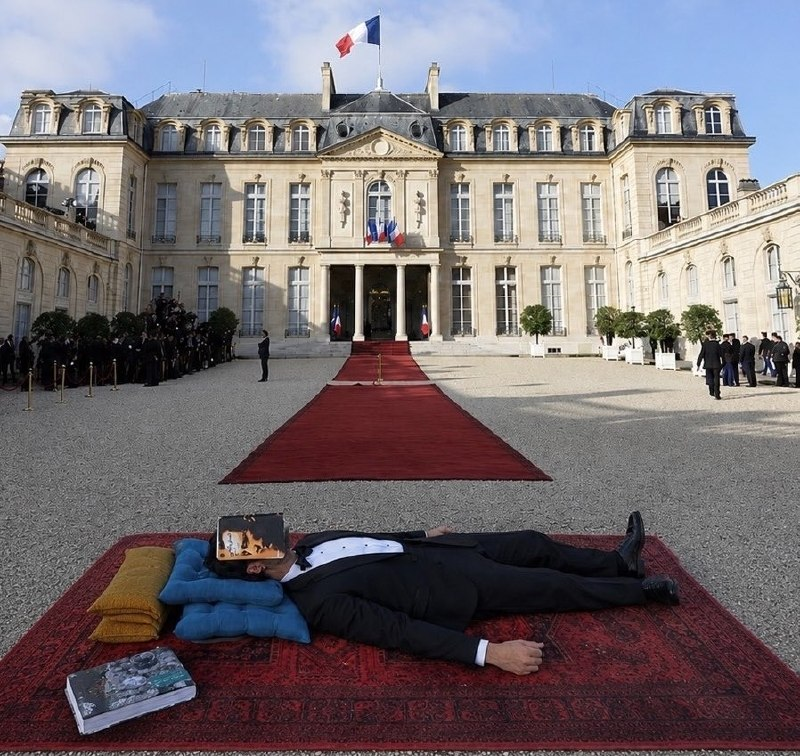

علی قمصری در کاخ الیزه در واکنش به رابطه «گلشیفته و مکرون»

@Dirty_Kids 👻

## Dirty_Kids — post 389394

  

شما غلط کردی با صاحابت.
از طرف مردم گه نخور.

@Dirty_Kids 👻

## Hearts2HeartsUpdateSM — post 23236

  

[INFO]

#HEARTS2HEARTS has been confirmed to appear at the Hanyang University Festival - Day 3

🔹️ Hanyang (RACHIOS): Splendor
📆 May 29, 2026

Cr. H2H_INA

🐝 [@Hearts2HeartsUpdateSM]

## Hearts2HeartsUpdateSM — post 23229

[260513] #YUHA WEVERSE UPDATE

🌱

🐝 [@Hearts2HeartsUpdateSM]

## Hearts2HeartsUpdateSM — post 23219

[260513] #A_NA WEVERSE UPDATE

I feel like it

🐝 [@Hearts2HeartsUpdateSM]

## Hearts2HeartsUpdateSM — post 23212

[260513] #JIWOO WEVERSE UPDATE

🍃

🐝 [@Hearts2HeartsUpdateSM]

---
📅 بروزرسانی: 1405/02/23 21:29
---

## VahidOOnLine — post 239955

  

سی‌ان‌ان گزارش داد سنای آمریکا برای هفتمین بار در سال جاری، طرحی را که با هدف محدود کردن اختیارات جنگی دونالد ترامپ و الزام او به دریافت مجوز کنگره برای هرگونه اقدام نظامی آینده در ایران ارائه شده بود، رد کرد.

این طرح با ۵۰ رای مخالف در برابر ۴۹ رای موافق از پیشبرد بازماند. بر اساس این گزارش، جان فترمن، سناتور دموکرات، در کنار جمهوری‌خواهان به رد طرح رای داد و رند پال، سوزان کالینز و لیزا مورکوفسکی، سناتورهای جمهوری‌خواه، همراه دموکرات‌ها از آن حمایت کردند.

سی‌ان‌ان نوشت برخی جمهوری‌خواهان، از جمله مورکوفسکی که امروز برای نخستین بار از این تلاش برای محدود کردن اختیارات جنگی حمایت کرد و تام تیلیس، استدلال کرده‌اند که با ادامه یافتن درگیری‌ها به بیش از ۶۰ روز، کنگره باید در مجوز دادن به جنگ نقش داشته باشد یا دست‌کم نظارت بیشتری اعمال کند.
‌🏁 🇬🇧 IranintlTV

🤖 @VahidOOnLine

## VahidOOnLine — post 239954

  

♦️ سی‌بی‌اس نیوز در گزارشی اختصاصی فاش کرد که بنیامین نتانیاهو، نخست‌وزیر اسرائیل، اخیرا در سفری محرمانه به امارات متحده عربی با شیخ محمد بن زاید، رئیس این کشور، دیدار کرده است. دفتر نتانیاهو با تأیید این سفر که در دوران جنگ علیه جمهوری اسلامی انجام شده، آن را منجر به «گشایشی تاریخی» در روابط دو کشور توصیف کرد. دولت امارات به پیگیری‌های سی‌بی‌اس در این باره پاسخی نداده است.

این دیدار در حالی فاش می‌شود که گزارش‌هایی مبنی بر حملات نظامی امارات به ایران در ماه گذشته منتشر شده است. مایک هاکبی، سفیر آمریکا در اسرائیل، تایید کرد که اسرائیل سامانه‌های پدافند هوایی «گنبد آهنین» و نیروهای متخصص را برای تقویت توان دفاعی امارات به این کشور ارسال کرده است. منابع آگاه نیز دریافت این سامانه‌ها توسط امارات را تایید کرده‌اند.

امارات که در سال ۲۰۲۰ اولین امضاکننده پیمان ابراهیم بود، پیش از این نیز در سال ۲۰۱۸ میزبان نتانیاهو بوده است.
‌🇸🇦 Indypersian

🤖 @VahidOOnLine

## VahidOOnLine — post 239953

  

دفتر نخست‌وزیری اسرائیل اعلام کرد بنیامین نتانیاهو، نخست‌وزیر این کشور، در جریان جنگ آمریکا و اسرائیل با جمهوری اسلامی، به‌طور مخفیانه به امارات متحده عربی سفر کرده است.

بر اساس این گزارش، نتانیاهو در این سفر با محمد بن زاید آل نهیان، رییس امارات متحده عربی، دیدار کرد.

دفتر نخست‌وزیری اسرائیل گفت این سفر به یک «پیشرفت تاریخی» در روابط اسرائیل و امارات متحده عربی منجر شده است.

پیش‌تر مقام‌های ارشد آمریکایی تایید کرده بودند اسرائیل در جریان جنگ با جمهوری اسلامی، یک سامانه گنبد آهنین و نیروهایی را برای راه‌اندازی آن به امارات فرستاده بود.
‌🏁 🇬🇧 IranintlTV

🤖 @VahidOOnLine

## VahidOOnLine — post 239952

  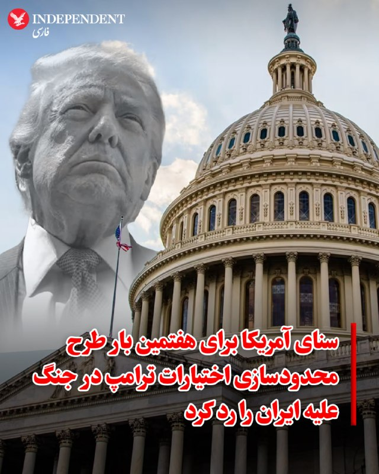

♦️ مجلس سنای آمریکا برای هفتمین بار در سال جاری، طرحی را که با هدف محدود کردن اختیارات جنگی دونالد ترامپ و الزام او به کسب مجوز از کنگره برای هرگونه اقدام نظامی علیه ایران تدوین شده بود، رد کرد. این مصوبه با ۴۹ رای موافق در برابر ۵۰ رای مخالف از دستور کار خارج شد؛ در این رای‌گیری، جان فترمن، سناتور دموکرات، به جمهوری‌خواهان پیوست و در مقابل، سه سناتور جمهوری‌خواه همسو با دموکرات‌ها رای دادند.

چاک شومر، رهبر اقلیت سنا، پیش‌تر اعلام کرده بود که دموکرات‌ها هر هفته این رای‌گیری را تکرار خواهند کرد. طبق «قطعنامه اختیارات جنگی»، استفاده از نیروی نظامی بدون مجوز کنگره دارای محدودیت ۶۰ روزه است که این مهلت در اول ماه مه به پایان رسیده است. با این حال، برخی جمهوری‌خواهان معتقدند روزهای آتش‌بس نباید در این بازه زمانی محاسبه شود. اگرچه سناتورهایی نظیر تام تیلیس بر ضرورت نظارت بیشتر کنگره تاکید دارند، اما اذعان می‌کنند که حتی در صورت تصویب چنین طرحی، توان مقابله با وتوی ریاست‌جمهوری وجود نخواهد داشت.
‌🇸🇦 Indypersian

🤖 @VahidOOnLine

## VahidOOnLine — post 239951

  

یک استاد ایرانی-آمریکایی دانشگاه آرکانزاس که اواخر ماه مارس به‌دلیل «فعالیت‌هایی در طرفداری از علی خامنه‌ای رهبر کشته‌شده جمهور اسلامی» از موقعیت رسمی خود برکنار شد، اکنون با تحقیقاتی درباره احتمال تخلفات علمی مواجه است.

انتشارات دانشگاه کمبریج که کتاب شیرین سعیدی، استاد ایرانی-آمریکایی دانشگاه آرکانزاس را منتشر کرده، در حال بررسی اتهاماتی است مبنی بر اینکه این اثر شامل مصاحبه‌های جعلی یا بدون مجوز با زنان قربانی حکومت ایران است. این کتاب بر پایه رساله دکترای شیرین سعیدی نوشته شده است.

ایران‌اینترنشنال دریافته است که دانشگاه کمبریج نیز در حال بررسی رساله دکترای سعیدی به‌دلیل احتمال تقلب است.

دکتر جی سیلوریا، رییس دانشگاه آرکانزاس، سعیدی را به دلایلی غیرمرتبط با تحقیقات کمبریج اخراج کرده است. او این تصمیم را به هیات امنای دانشگاه ابلاغ کرده و قرار است این هیات در ۲۱ مه پرونده اخراج او را بررسی کند.

کتاب سعیدی با عنوان «زنان و جمهوری اسلامی: چگونه شهروندی جنسیتی دولت ایران را شکل می‌دهد» اکنون در بریتانیا زیر ذره‌بین قرار دارد.

ادامه این گزارش را در وبسایت ایران‌اینترنشنال بخوانید
‌🏁 🇬🇧 IranintlTV

🤖 @VahidOOnLine

## VahidOOnLine — post 239950

  <a href="telegram/content/VahidOOnLine_239950_1778695198.mp4" target="_blank">🎬 Download video</a>

♦️ ستاد فرماندهی مرکزی ایالات متحده (سنتکام) روز چهارشنبه ۲۳ اردیبهشت اعلام کرد که در جریان اجرای طرح محاصره بنادر ایران، نیروهای آمریکایی مسیر ۶۷ کشتی تجاری را تغییر داده و چهار شناور را نیز از کار انداخته‌اند. طبق اعلام این نهاد، تاکنون تنها به ۱۵ شناور حامل کمک‌های بشردوستانه اجازه عبور داده شده است.

سنتکام در شبکه اجتماعی ایکس تایید کرد که در اوایل هفته جاری، نیروهای این فرماندهی با استفاده از ارتباط رادیویی و شلیک تیرهای هشدار با سلاح‌های سبک، دو کشتی تجاری دیگر را مجبور به بازگشت و تمکین از قوانین محاصره کرده‌اند. این بیانیه تاکید می‌کند که اقدامات مذکور نشان‌دهنده اجرای کامل و قاطعانه محاصره توسط نیروهای آمریکایی است.
‌🇸🇦 Indypersian

🤖 @VahidOOnLine

## VahidOOnLine — post 239949

  <a href="telegram/content/VahidOOnLine_239949_1778695200.mp4" target="_blank">🎬 Download video</a>

عباس عراقچی، وزیر خارجه جمهوری‌اسلامی در شبکه اکس بازداشت چهار شهروند ایرانی در خلیج فارس توسط کویت را تایید کرد. عراقچی در اکس نوشته: «در تلاشی آشکار برای ایجاد اختلاف، کویت به‌طور غیرقانونی به یک قایق ایرانی حمله کرده و چهار تن از شهروندان ما را در خلیج فارس بازداشت کرده است. این اقدام غیرقانونی در نزدیکی جزیره‌ای رخ داد که آمریکا از آن برای حمله به ایران استفاده کرده بود. ما خواستار آزادی فوری شهروندان خود هستیم و حق پاسخ‌گویی را برای خود محفوظ می‌دانیم.» کویت دیروز اعلام کرده بود چهار عضو منتسب به سپاه قصد داشتند از راه دریا وارد کویت شوند و «اقدامات خصمانه» انجام دهند. وزارت کشور کویت اعلام کرد در درگیری با نیروهای امنیتی، یک نیروی کویتی زخمی شده و دو نفر از متهمان نیز فرار کرده‌اند. سفیر جمهوری‌اسلامی نیز در این کشور احضار و یادداشت اعتراضی رسمی به او تحویل داده شده بود.
‌🏁 🇬🇧 ManotoTV

🤖 @VahidOOnLine

## VahidOOnLine — post 239948

  <a href="telegram/content/VahidOOnLine_239948_1778695200.mp4" target="_blank">🎬 Download video</a>

شعبه اول دادگاه تجدیدنظر استان کهگیلویه و بویراحمد، فیض‌الله آذرنوش، پدر پدرام آذرنوش از جان‌باختگان اعتراضات ۱۴۰۱، به همراه سه شهروند دیگر این پرونده را در مجموع به ۳۰ سال حبس تعزیری محکوم کرد.

بر اساس حکم صادرشده، فیض‌الله آذرنوش با اتهام‌هایی از جمله «تشکیل گروه با هدف برهم زدن امنیت کشور»، «فعالیت تبلیغی علیه جمهوری اسلامی»، «توهین به رهبری» و «اجتماع و تبانی علیه امنیت کشور» در مجموع به ۱۵ سال زندان محکوم شده که پنج سال آن قابل اجراست.

همچنین میلاد کریمی‌نسب به شش سال زندان با پنج سال حبس قابل اجرا، امیرحسین محسنی‌پور به شش سال زندان با سه سال حبس قابل اجرا و مهدی کرمی به سه سال زندان محکوم شدند.
‌🏁 🇬🇧 ManotoTV

🤖 @VahidOOnLine

## VahidOOnLine — post 239947

  

نیویورک تایمز در گزارشی اعلام کرد که کشورهای حاشیه خلیج فارس در جریان جنگ ایران، بیش از ۱۰۰ شیعه را به اتهام خیانت بازداشت کرده‌اند.
کویت، امارات متحده عربی و بحرین از جمله کشورهایی هستند که موج بازداشت‌ها در آن‌ها گزارش شده است.
در بحرین ۶۹ نفر از تابعیت محروم شده‌اند و ۴۱ نفر دیگر به اتهام ارتباط با سپاه پاسداران بازداشت شده‌اند. یک گروه حقوق بشری می‌گوید ۳۷ نفر از بازداشت‌شدگان روحانی شیعه بوده‌اند.
در امارات متحده عربی ۲۷ نفر به عضویت در «سازمان تروریستی شیعه» متهم شده‌اند. دولت تصاویر آن‌ها را منتشر کرده و برخی چهره‌های نزدیک به حکومت خواستار مجازات شدید شده‌اند.

‌🏁 🇬🇧 IranintlTV

🤖 @VahidOOnLine

## VahidOOnLine — post 239946

♦️چارلز سوم، پادشاه بریتانیا روز چهارشنبه در سخنرانی رسمی بازگشایی پارلمان این کشور در مجلس اعیان، در حالی که اعضای دولت، نمایندگان پارلمان و کی‌یر استارمر، نخست‌وزیر بریتانیا حضور داشتند، برنامه‌ها و اولویت‌های دولت را تشریح کرد.
او با اشاره مستقیم به بحران خاورمیانه گفت: «جهانی به‌طور فزاینده خطرناک و بی‌ثبات، بریتانیا را تهدید می‌کند و درگیری در خاورمیانه تنها جدیدترین نمونه آن است. تمام عناصر امنیت انرژی، دفاعی و اقتصادی کشور مورد آزمایش قرار خواهند گرفت.»
چارلز سوم در ادامه تاکید کرد دولت بریتانیا قصد دارد تصمیم‌هایی اتخاذ کند که امنیت بلندمدت انرژی، دفاع و اقتصاد این کشور را تضمین کند. او همچنین از برنامه دولت برای تصویب «قانون استقلال انرژی» خبر داد؛ طرحی که هدف آن افزایش تولید انرژی داخلی، توسعه انرژی‌های تجدیدپذیر و کاهش وابستگی بریتانیا به منابع خارجی عنوان شده است.
پادشاه بریتانیا با اشاره به تحولات اخیر خاورمیانه هشدار داد که وابستگی انرژی می‌تواند به ابزاری برای فشار اقتصادی علیه مردم بریتانیا تبدیل شود.
‌🇸🇦 Indypersian

🤖 @VahidOOnLine

## VahidOOnLine — post 239945

یک شهروند در پیامی به ایران اینترنشنال درباره سرکوب و بحران‌های اقتصادی و معیشتی می‌گوید مردم در ایران گروگان حکومت هستند. او از رهبران آمریکا و اسرائیل می‌خواهد با جمهوری اسلامی مذاکره و آتش‌بس نکنند. صدای این مخاطب با هوش مصنوعی بازخوانی شده است.
‌🏁 🇬🇧 IranintlTV

🤖 @VahidOOnLine

## VahidOOnLine — post 239944

  

♦️ به گزارش خبرگزاری فارس، در پی اختلال در واردات از بنادر جنوبی به دلیل شرایط جنگی و محاصره دریایی، نیمی از واردات دریایی ایران به مرزهای زمینی و نیمی دیگر به بنادر و مرزهای شمالی منتقل شده است. علی مدنی‌زاده، وزیر اقتصاد، با تایید این تغییر راهبردی اعلام کرد که انتقال گذرگاه‌ها پس از کندی روند واردات از جنوب در دستور کار دولت قرار گرفته است. در حالی که ظرفیت واردات سالانه بنادر جنوبی ۳۸ میلیون تن است، بنادر شمالی کشور با ظرفیت اسمی ۳۰ میلیون تن، پتانسیل بالایی برای جایگزینی دارند.

هم‌زمان، پاکستان با صدور مجوزی رسمی از سوی وزارت بازرگانی، گام مهمی در فعال‌سازی گذرگاه ترانزیتی با ایران برداشته است. این دستور اجازه می‌دهد کالاهای کشورهای ثالث از بنادر گوادر، کراچی و قاسم از طریق مسیرهای جاده‌ای به مرزهای گبد و تفتان منتقل شوند. با توجه به ناپایداری مسیرهای سنتی مانند بنادر امارات در پی محاصره دریایی، گشایش این مسیر جدید امنیت زنجیره تامین ایران را تقویت می‌کند. پیش از این نیز محموله‌های ترانزیتی با موفقیت از مبدا پاکستان و مسیر ایران به مقصد ازبکستان ارسال شده بود.
‌🇸🇦 Indypersian

🤖 @VahidOOnLine

## VahidOOnLine — post 239943

  <a href="telegram/content/VahidOOnLine_239943_1778695202.mp4" target="_blank">🎬 Download video</a>

.
مقام‌های سوریه در ماه مارس «هلا منیر محمد» را به اتهام شکنجه و سوءاستفاده از زندانیان در دوران حکومت بشار اسد بازداشت کردند؛ زنی که به گفته زندانیان سابق، با نام «منیره» در زندان اطلاعات نیروی هوایی دمشق شناخته می‌شد و یکی از مخوف‌ترین نگهبانان این زندان بود.
بر اساس گزارش‌ها، هلا در ظاهر یک آرایشگر شناخته‌شده و مدرس زیبایی در دمشق بود، اما چندین زندانی سابق می‌گویند او در زندان المزّه با ضرب‌وشتم، تحقیر، توهین فرقه‌ای و شکنجه زنان زندانی شناخته می‌شد.
زندانیان سابق می‌گویند تنها صدای او برای ایجاد وحشت در سلول‌ها کافی بود. برخی روایت کرده‌اند او با لوله‌های پلاستیکی زندانیان را کتک می‌زد، موهای زنان را با خشونت می‌برید و هنگام آزار آن‌ها می‌خندید.
گزارش‌ها حاکی است هلا پس از سقوط حکومت اسد همچنان در دمشق زندگی می‌کرد و به‌عنوان آرایشگر فعالیت داشت تا اینکه گروهی از بازماندگان زندان با تحقیقات مستقل او را شناسایی و به مقام‌های جدید سوریه معرفی کردند.
خانواده و برخی آشنایان هلا اتهام‌ها را رد کرده‌اند و می‌گویند او «فقط یک زن جوان» بوده که دستورات مافوق‌ها را اجرا می‌کرده است. سازمان‌های حقوق بشری می‌گویند ده‌ها هزار نفر در دوران جنگ داخلی سوریه در زندان‌های حکومت اسد ناپدید یا کشته شده‌اند و زندان اطلاعات نیروی هوایی المزّه یکی از مراکز اصلی شکنجه و بازداشت بوده است.
‌🏁 🇬🇧 ManotoTV

🤖 @VahidOOnLine

## VahidOOnLine — post 239942

  <a href="telegram/content/VahidOOnLine_239942_1778695203.mp4" target="_blank">🎬 Download video</a>

تصاویری از استقبال از عباس عراقچی، وزیر خارجه جمهوری‌اسلامی در پایتخت هند، توسط رسانه‌های حکومتی منتشر شده است. بر پایه گزارش‌ها او برای شرکت در نشست وزرای خارجه بریکس وارد دهلی نو شده است.
‌🏁 🇬🇧 ManotoTV

🤖 @VahidOOnLine

## VahidOOnLine — post 239941

یک شهروند در پیامی به ایران اینترنشنال درباره سرکوب و بحران‌های اقتصادی و معیشتی می‌گوید مردم در ایران گروگان حکومت هستند. او از رهبران آمریکا و اسرائیل می‌خواهد با جمهوری اسلامی مذاکره و آتش‌بس نکنند. صدای این مخاطب با هوش مصنوعی بازخوانی شده است.
‌🏁 🇬🇧 IranintlTV

🤖 @VahidOOnLine

## WithYashar — post 11160

طبق گزارش NBC که به داده‌های ناوبری استناد کرده است.چندین کشتی باری و نفتکش مرتبط با چین در ۲۴ ساعت گذشته از تنگه هرمز عبور کرده‌اند
@withyashar

## WithYashar — post 11159

شکست هفتمین رأی‌گیری سنای امریکا برای پایان جنگ علیه ایران
@withyashar

## WithYashar — post 11158

  <a href="telegram/content/WithYashar_11158_1778695203.mp4" target="_blank">🎬 Download video</a>

امشب چین 😂
@withyashar

## WithYashar — post 11157

  <a href="telegram/content/WithYashar_11157_1778695205.mp4" target="_blank">🎬 Download video</a>

همراهان ترامپ در چین
@withyashar

## mwarmonitor — post 9050

🔵شبکه NBC به نقل از داده‌های ناوبری: چندین کشتی باری و نفتکش مرتبط با چین طی ۲۴ ساعت گذشته از تنگه هرمز عبور کرده‌اند.

@mwarmonitor

## mwarmonitor — post 9049

🔴 فایننشال‌تایمز: اریک پسر دونالد ترامپ قرار است رئیس‌جمهور آمریکا را در یک سفر رسمی به پکن همراهی کند؛ هم‌زمان، یک گروه مرتبط با خانواده ترامپ در حال بررسی یک توافق با یک شرکت چینی سازنده تراشه است که کنگره آمریکا هشدار داده با حزب کمونیست چین ارتباط دارد.

@mwarmonitor

## mwarmonitor — post 9048

🔴وال‌استریت ژورنال: مقامات کاخ سفید در حال بررسی طرحی هستند که بر اساس آن رئیس‌جمهور ترامپ به مناسبت جشن دویست‌وپنجاهمین سالگرد تولد این کشور، ۲۵۰ عفو صادر کند.

@mwarmonitor

## mwarmonitor — post 9047

🔴 فوری: بنیامین نتانیاهو به‌طور محرمانه به امارات متحده عربی سفر کرده و در جریان عملیات «شیر غران» علیه ایران با محمد بن زاید دیدار کرده است. i24 news

@mwarmonitor

## mwarmonitor — post 9046

  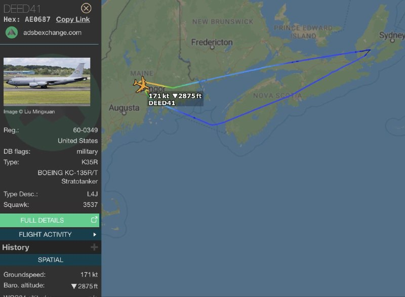

✈️مأموریت WENCH11 (بمب‌افکن رادارگریز B-2A Spirit)
🔸پس از سوخت‌گیری هوایی با پرواز DEED41 (تانکر KC-135 Stratotanker) بر فراز نوا اسکوشیا شرق کانادا، روی مسیر سوخت‌رسانی AR20NE، در باند VHF با Gander Radio در ارتباط بوده است.

@mwarmonitor

## mwarmonitor — post 9045

  

✈️ساعت 09:31 ـ 09:35 به وقت گرینویچ MISS 40 | 41 دو فروند بمب‌افکن استراتژیک B-1B از پایگاه Fairford به پرواز درآمده و با Brize در فرکانس 231.950 در حال ارتباط است. @mwarmonitor

## mwarmonitor — post 9044

🚨 «شورای صلح» به رهبری آمریکا قصد دارد اجرای طرح خود برای تشکیل یک حکومت جدید و بازسازی غزه را در بخش‌هایی از غزه که تحت کنترل حماس نیست آغاز کند.

🚨 چرا این مهم است: تصمیم برای رفتن به «طرح B» در غزه پس از آن گرفته شد که تلاش‌ها برای متقاعد کردن حماس به کنار گذاشتن سلاح‌های سنگین خود به بن‌بست رسید. اکنون آمریکا و «شورای صلح» می‌خواهند بدون حضور حماس پیش بروند. باراک راوید خبرنگار آکسیوس

@mwarmonitor

## FoxNewsTwitter — post 341661

  

Fox News (Twitter/X)

“Funny how they never attack my policy ideas... I’m in the arena, son.”

Spencer Pratt is firing back at his critics after L.A. mayoral candidate Nithya Raman called him to “mini Trump” and warned voters about the "fascism" he may bring to office.

Pratt says opponents are dodging substance and focusing on his past, arguing they “want the continued decline of the city.”

Raman says his rise is fueled by frustration across Los Angeles, but is trying to warn voters of heading “in the wrong direction” if that anger isn’t addressed differently.

Pratt, running as an independent after losing his home in the Pacific Palisades fire, has leaned into criticism of current leadership as recovery efforts remain a major issue.

He's been gaining ground in the race, fueled in part by voters sharing his same frustrations with the status quo.

## FoxNewsTwitter — post 341660

  

Fox News (Twitter/X)

"New York City believes in punishing success."

Dallas Mayor Eric Johnson says the clash between NYC leadership and finance giants is pushing firms to reconsider where they operate — and Texas is welcoming them with open arms.

His pitch for "Y’all Street" over Wall Street comes as a steady stream of financial firms expand their operations in Texas.

They were drawn there because of lower taxes and fewer regulations, a trend Johnson says is accelerating even more under New York City Mayor Zohran Mamdani.

## FoxNewsTwitter — post 341659

  

Fox News (Twitter/X)

WATCH LIVE: DHS Secretary Mullin delivers remarks at ICE headquarters https://twitter.com/i/broadcasts/1DxLdvpQpXRxm

## FoxNewsTwitter — post 341658

‌Fox News (Twitter/X)

Read more:

## FoxNewsTwitter — post 341657

  

Fox News (Twitter/X)

AI put her behind bars - for a crime hundreds of miles away.

Angela Lipps says she had never been to North Dakota, yet U.S. Marshals arrested her at gunpoint while babysitting in Tennessee after facial recognition technology flagged her as a match for bank fraud reports.

The grandmother spent more than five months in jail before the mistake came to light and the case was dismissed.

## FoxNewsTwitter — post 341656

‌Fox News (Twitter/X)

BREAKING: Senate rejects Democrat-backed Iran resolution to handcuff Trump's war powers for 7th time, with Republicans Lisa Murkowski joining Rand Paul and Susan Collins in supporting the measure

## FoxNewsTwitter — post 341655

  <a href="telegram/content/FoxNewsTwitter_341655_1778695209.mp4" target="_blank">🎬 Download video</a>

Fox News (Twitter/X)

NEW: Former Border Patrol agent Ammon Blair reveals how officials were “mandated to look the other way” as the migrant crisis grew under the Biden administration.

“We were mandated to look the other way under prosecutorial discretion, we released known terrorists where we didn't know it until after the fact.”

“We had multiple people from all across the world coming into the United States with falsified documents, specifically from Iran, who'd come in with Venezuelan documents.”

## FoxNewsTwitter — post 341654

Fox News (Twitter/X)

“Slavery is over. Jim Crow is dead.”

Rep. Wesley Hunt pushes back on what he calls “reinvigorated talk” of Jim Crow, while defending the idea that America is a Christian nation:

"As someone who is a direct descendant of a slave, as someone whose great-great-grandfather was born on a plantation, I can assure you, slavery is over. Jim Crow is dead."

"I am a Black man representing a White-majority district in Texas, the great-great-grandson of a man born on a plantation stands before you today as a proud, conservative Republican from Texas. As a believer and follower in Christ."

## pm_afshaa — post 90705

یکی بیاد به من بگه چرا تو افغانستان خوراکیای تولید داخل خودمونو ارزونتر از ما میتونن خرید کنن

د اخه حرومزاده ای که نشستی خفه خون گرفتی از این بیناموسا دفاع میکنی بیناموس برگرد ببین چند نفر نون شب تو کشور خودمون ندارن بخورن

د اخه من شاشیدم به اون مملکت داریتون

## pm_afshaa — post 90704

  <a href="telegram/content/pm_afshaa_90704_1778695210.webm" target="_blank">🎬 Download video</a>

🔴نیویورک تایمز: کشورهای خلیج فارس در جریان جنگ ایران بیش از 100 شیعه رو به اتهام خیانت بازداشت شدن.

💧 Rainbet.com the #1 Non-KYC Crypto Casino & Sportsbook @rainbetcom

😁 @Pm_Afshaa

## pm_afshaa — post 90703

  <a href="telegram/content/pm_afshaa_90703_1778695211.webm" target="_blank">🎬 Download video</a>

🔴دنیامالی، وزیر ورزش:
تیم ملی به جام جهانی میره و بازیکنان سرود جمهوری اسلامی رو فریاد میزنن.

💧 Rainbet.com the #1 Non-KYC Crypto Casino & Sportsbook @rainbetcom

😁 @Pm_Afshaa

## pm_afshaa — post 90702

🔴دفتر نخست وزیر اسرائیل:
در بحبوحه جنگ و عملیات غرش شیر، نتانیاهو به امارات سفر کرد و با شیخ محمدبن زاید، رئیس امارات متحده عربی دیدار کرد.

این سفر منجر به پیشرفتی تاریخی در روابط اسرائیل و امارات شد.

💧 Rainbet.com the #1 Non-KYC Crypto Casino & Sportsbook @rainbetcom

😁 @Pm_Afshaa

## pm_afshaa — post 90701

  <a href="telegram/content/pm_afshaa_90701_1778695211.mp4" target="_blank">🎬 Download video</a>

اکانت اسرائیل به فارسی:وقتی به زودی به اسرائیل سفر کنید، این منظره زیبا از پنجره هواپیما در انتظار شماست. به امید دیدار شما در تل‌آویو یا تهران

💧 Rainbet.com the #1 Non-KYC Crypto Casino & Sportsbook @rainbetcom

😁 @Pm_Afshaa

## pm_afshaa — post 90700

  <a href="telegram/content/pm_afshaa_90700_1778695213.webm" target="_blank">🎬 Download video</a>

🔴عباس عراقچی:

کویت در اقدامی آشکار برای ایجاد اختلاف، به طور غیرقانونی به یک قایق ایرانی حمله کرد و چهار شهروند رو در خلیج فارس بازداشت کرد. این اقدام غیرقانونی در نزدیکی جزیره‌ای رخ داد که آمریکا از آن برای حمله به ایران استفاده میکنه. ما خواستار آزادی فوری شهروندان خود هستیم و حق پاسخگویی رو برای خود محفوظ می‌داریم.

💧 Rainbet.com the #1 Non-KYC Crypto Casino & Sportsbook @rainbetcom

😁 @Pm_Afshaa

## pm_afshaa — post 90699

  <a href="telegram/content/pm_afshaa_90699_1778695213.webm" target="_blank">🎬 Download video</a>

🔴هفتمین رأی‌گیری سنای آمریکا توسط دموکرات‌ها برای محدود کردن اختیارات جنگی ترامپ و پایان جنگ با جمهوری اسلامی بازهم شکست خورد.

تعداد آرا فاصله نزدیک 50 به 49 داشت!

💧 Rainbet.com the #1 Non-KYC Crypto Casino & Sportsbook @rainbetcom

😁 @Pm_Afshaa

## pm_afshaa — post 90698

  <a href="telegram/content/pm_afshaa_90698_1778695214.webm" target="_blank">🎬 Download video</a>

🔴سنتکام: از آغاز محاصره دریایی 67 کشتی مجبور به تغییر مسیر شدن.

💧 Rainbet.com the #1 Non-KYC Crypto Casino & Sportsbook @rainbetcom

😁 @Pm_Afshaa

## pm_afshaa — post 90697

  <a href="telegram/content/pm_afshaa_90697_1778695214.webm" target="_blank">🎬 Download video</a>

🔴خواسته‌های احتمالی ترامپ از چین سر ایران چیه؟

1- کمک چین به ایران متوقف بشه حالا میخواد نظامی باشه یا اطلاعاتی و...

2- چین رو متقاعد کنه که نفت خودش رو از کشور های دیگه‌ای بجز ایران تامین کنه و نذاره تنگه هرمز بشه محلی برای کسب درآمد ایران.

3- به چین بگه ایندفعه دیگه قطعنامه برعلیه ایران رو تو جلسه شورای حکام وتو نکنن و بذارن رای بیاره تا اجماع جهانی برعلیه ایران شکل بگیره سر تنگه هرمز.

💧 Rainbet.com the #1 Non-KYC Crypto Casino & Sportsbook @rainbetcom

😁 @Pm_Afshaa

## DEJradio — post 4621

  <a href="telegram/content/DEJradio_4621_1778695215.mp4" target="_blank">🎬 Download video</a>

👑🎥 همدلی و حمایت ایرانیان ونکوور از انقلاب شیر و خورشید

#ونکوور #انقلاب_شیروخورشید
@DEJradio

## IranIntlTV — post 337037

  

سی‌ان‌ان گزارش داد سنای آمریکا برای هفتمین بار در سال جاری، طرحی را که با هدف محدود کردن اختیارات جنگی دونالد ترامپ و الزام او به دریافت مجوز کنگره برای هرگونه اقدام نظامی آینده در ایران ارائه شده بود، رد کرد.

این طرح با ۵۰ رای مخالف در برابر ۴۹ رای موافق از پیشبرد بازماند. بر اساس این گزارش، جان فترمن، سناتور دموکرات، در کنار جمهوری‌خواهان به رد طرح رای داد و رند پال، سوزان کالینز و لیزا مورکوفسکی، سناتورهای جمهوری‌خواه، همراه دموکرات‌ها از آن حمایت کردند.

سی‌ان‌ان نوشت برخی جمهوری‌خواهان، از جمله مورکوفسکی که امروز برای نخستین بار از این تلاش برای محدود کردن اختیارات جنگی حمایت کرد و تام تیلیس، استدلال کرده‌اند که با ادامه یافتن درگیری‌ها به بیش از ۶۰ روز، کنگره باید در مجوز دادن به جنگ نقش داشته باشد یا دست‌کم نظارت بیشتری اعمال کند.
https://iranintl.com/202605133904

## IranIntlTV — post 337036

  

دفتر نخست‌وزیری اسرائیل اعلام کرد بنیامین نتانیاهو، نخست‌وزیر این کشور، در جریان جنگ آمریکا و اسرائیل با جمهوری اسلامی، به‌طور مخفیانه به امارات متحده عربی سفر کرده است.

بر اساس این گزارش، نتانیاهو در این سفر با محمد بن زاید آل نهیان، رییس امارات متحده عربی، دیدار کرد.

دفتر نخست‌وزیری اسرائیل گفت این سفر به یک «پیشرفت تاریخی» در روابط اسرائیل و امارات متحده عربی منجر شده است.

پیش‌تر مقام‌های ارشد آمریکایی تایید کرده بودند اسرائیل در جریان جنگ با جمهوری اسلامی، یک سامانه گنبد آهنین و نیروهایی را برای راه‌اندازی آن به امارات فرستاده بود.
https://iranintl.com/202605131963

## IranIntlTV — post 337035

  <a href="telegram/content/IranIntlTV_337035_1778695217.mp4" target="_blank">🎬 Download video</a>

دفتر نخست‌وزیر اسرائیل اعلام کرد بنیامین نتانیاهو در دوران جنگ به امارات متحده عربی سفر کرده است.

اردوان روزبه، خبرنگار ایران‌اینترنشنال، گزارش می‌دهد

@iranintltv

## IranIntlTV — post 337034

  <a href="telegram/content/IranIntlTV_337034_1778695218.mp4" target="_blank">🎬 Download video</a>

گزارش‌های تازه ابعاد جدیدی از نقش و تحرکات ریاض و ابوظبی در جنگ ایران رو فاش می‌کنند. وال استریت ژورنال می‌گوید دیوید بارنیا، رییس موساد، در دوران جنگ دست‌کم دو بار، به صورت محرمانه به امارات سفر کرده است.

سمیرا قرایی و بابک اسحاقی، خبرنگاران ایران‌اینترنشنال، گزارش می‌دهند
@iranintltv

## IranIntlTV — post 337033

  

🔻خبرگزاری تسنیم، وابسته به سپاه پاسداران نوشت که مجید موسوی، فرمانده نیروی هوافضا سپاه در پیامی خطاب به بازیکنان تیم ملی پیش از حضور در جام جهانی نوشته است: «سلامی (فرمانده پیشین سپاه پاسداران) توصیه کرد: اگر می‌خواهید جام را ببرید تیمی بازی کنید.»

@iranintltvsport

## IranIntlTV — post 337032

  <a href="telegram/content/IranIntlTV_337032_1778695220.mp4" target="_blank">🎬 Download video</a>

تیتر اول با نیوشا صارمی، چهارشنبه ۲۳ اردیبهشت
@iranintltv

## IranIntlTV — post 337031

  

یک استاد ایرانی-آمریکایی دانشگاه آرکانزاس که اواخر ماه مارس به‌دلیل «فعالیت‌هایی در طرفداری از علی خامنه‌ای رهبر کشته‌شده جمهور اسلامی» از موقعیت رسمی خود برکنار شد، اکنون با تحقیقاتی درباره احتمال تخلفات علمی مواجه است.

انتشارات دانشگاه کمبریج که کتاب شیرین سعیدی، استاد ایرانی-آمریکایی دانشگاه آرکانزاس را منتشر کرده، در حال بررسی اتهاماتی است مبنی بر اینکه این اثر شامل مصاحبه‌های جعلی یا بدون مجوز با زنان قربانی حکومت ایران است. این کتاب بر پایه رساله دکترای شیرین سعیدی نوشته شده است.

ایران‌اینترنشنال دریافته است که دانشگاه کمبریج نیز در حال بررسی رساله دکترای سعیدی به‌دلیل احتمال تقلب است.

دکتر جی سیلوریا، رییس دانشگاه آرکانزاس، سعیدی را به دلایلی غیرمرتبط با تحقیقات کمبریج اخراج کرده است. او این تصمیم را به هیات امنای دانشگاه ابلاغ کرده و قرار است این هیات در ۲۱ مه پرونده اخراج او را بررسی کند.

کتاب سعیدی با عنوان «زنان و جمهوری اسلامی: چگونه شهروندی جنسیتی دولت ایران را شکل می‌دهد» اکنون در بریتانیا زیر ذره‌بین قرار دارد.

ادامه این گزارش را در وبسایت ایران‌اینترنشنال بخوانید
https://iranintl.com/202

## IranIntlTV — post 337030

  

نیویورک تایمز در گزارشی اعلام کرد که کشورهای حاشیه خلیج فارس در جریان جنگ ایران، بیش از ۱۰۰ شیعه را به اتهام خیانت بازداشت کرده‌اند.
کویت، امارات متحده عربی و بحرین از جمله کشورهایی هستند که موج بازداشت‌ها در آن‌ها گزارش شده است.
در بحرین ۶۹ نفر از تابعیت محروم شده‌اند و ۴۱ نفر دیگر به اتهام ارتباط با سپاه پاسداران بازداشت شده‌اند. یک گروه حقوق بشری می‌گوید ۳۷ نفر از بازداشت‌شدگان روحانی شیعه بوده‌اند.
در امارات متحده عربی ۲۷ نفر به عضویت در «سازمان تروریستی شیعه» متهم شده‌اند. دولت تصاویر آن‌ها را منتشر کرده و برخی چهره‌های نزدیک به حکومت خواستار مجازات شدید شده‌اند.

https://iranintl.com/202605137296

## IranIntlTV — post 337029

  

ایران، قربانی جنگ، فساد و ریاکاری جمهوری اسلامی است و میان مردم و حاکمیت، دریایی از خون قرار گرفته است. جمهوری اسلامی و مردم در نقطه‌ای تاریخی و بی‌بازگشت ایستاده‌اند. هزینه‌ای که به مردم ایران تحمیل شده، جامعه را خشمگین کرده است؛ خشمی که هر روز بیشتر می‌شود.

این خشم انباشتهٔ مردم چه زمانی فوران خواهد کرد؟

«برنامه» صدای شماست. ما شما را مستقیم از ایران روی خط می‌آوریم.

برای شرکت در برنامه، همین حالا در واتس‌اپ پیام بدهید:
۰۰۴۴۷۵۲۲۱۱۰۱۱۰
۰۰۴۴۷۵۴۴۱۱۰۱۱۰
۰۰۴۴۷۵۱۱۱۰۲۵۵۳

«برنامه با کامبیز حسینی»
«یک ایران صدای شما را می‌شنود»

@iranintltv

## IranIntlTV — post 337028

یک شهروند در پیامی به ایران اینترنشنال درباره سرکوب و بحران‌های اقتصادی و معیشتی می‌گوید مردم در ایران گروگان حکومت هستند. او از رهبران آمریکا و اسرائیل می‌خواهد با جمهوری اسلامی مذاکره و آتش‌بس نکنند. صدای این مخاطب با هوش مصنوعی بازخوانی شده است.

## IranIntlTV — post 337027

  <a href="telegram/content/IranIntlTV_337027_1778695223.mp4" target="_blank">🎬 Download video</a>

سازمان حقوق بشر برای ورزش نسبت به اجرای حکم اعدام احسان حسینی‌پور، فوتبالیست ۱۹ ساله، هشدار داد.

براساس این گزارش، حکم اعدام او در دیوان عالی تایید شده است. حسینی‌پور در اعتراضات ۱۸ دی‌ماه بازداشت شد.

گفت‌وگو با مهدی رستم‌پور، خبرنگار ورزشی
@iranintltv

## IranIntlTV — post 337026

یک شهروند در پیامی به ایران اینترنشنال درباره سرکوب و بحران‌های اقتصادی و معیشتی می‌گوید مردم در ایران گروگان حکومت هستند. او از رهبران آمریکا و اسرائیل می‌خواهد با جمهوری اسلامی مذاکره و آتش‌بس نکنند. صدای این مخاطب با هوش مصنوعی بازخوانی شده است.

## IranIntlTV — post 337025

  <a href="https://t.me/IranintlTV/337025" target="_blank">📎 Download file</a>

🎧نسخه صوتی اخبار شبانگاهی | چهارشنبه ۲۳ اردیبهشت
@iranintlTV

## IranIntlTV — post 337024

  <a href="telegram/content/IranIntlTV_337024_1778695225.mp4" target="_blank">🎬 Download video</a>

قوه قضاییه جمهوری اسلامی خبر داد احسان افرشته، جوان ۳۳ ساله‌، را به اتهام همکاری با اسرائیل، اعدام کرده اما دو منبع گفتند او، پیش از بازگشت به ایران از ترکیه، به‌طور داوطلبانه خود را به وزارت اطلاعات معرفی کرده بود اما بلافاصله در فرودگاه بازداشت شد.

گزارشی از مجتبا پورمحسن
@iranintltv

## Shin_Persian — post 5991

Emanuel (Mannie) Fabian ✓ @manniefabian
Wed, 13 May 2026 17:01:27 UTC

Prime Minister Benjamin Netanyahu visited the UAE during the Iran war, his office says.

فارسی

دفتر بنیامین نتانیاهو، نخست‌وزیر، اعلام کرد که وی در طول جنگ ایران از امارات متحده عربی بازدید کرده است.

𝕏 · @shin_persian

## ManotoTV — post 105410

  <a href="telegram/content/ManotoTV_105410_1778695227.mp4" target="_blank">🎬 Download video</a>

عباس عراقچی، وزیر خارجه جمهوری‌اسلامی در شبکه اکس بازداشت چهار شهروند ایرانی در خلیج فارس توسط کویت را تایید کرد. عراقچی در اکس نوشته: «در تلاشی آشکار برای ایجاد اختلاف، کویت به‌طور غیرقانونی به یک قایق ایرانی حمله کرده و چهار تن از شهروندان ما را در خلیج فارس بازداشت کرده است. این اقدام غیرقانونی در نزدیکی جزیره‌ای رخ داد که آمریکا از آن برای حمله به ایران استفاده کرده بود. ما خواستار آزادی فوری شهروندان خود هستیم و حق پاسخ‌گویی را برای خود محفوظ می‌دانیم.» کویت دیروز اعلام کرده بود چهار عضو منتسب به سپاه قصد داشتند از راه دریا وارد کویت شوند و «اقدامات خصمانه» انجام دهند. وزارت کشور کویت اعلام کرد در درگیری با نیروهای امنیتی، یک نیروی کویتی زخمی شده و دو نفر از متهمان نیز فرار کرده‌اند. سفیر جمهوری‌اسلامی نیز در این کشور احضار و یادداشت اعتراضی رسمی به او تحویل داده شده بود.

## ManotoTV — post 105409

  <a href="telegram/content/ManotoTV_105409_1778695227.mp4" target="_blank">🎬 Download video</a>

شعبه اول دادگاه تجدیدنظر استان کهگیلویه و بویراحمد، فیض‌الله آذرنوش، پدر پدرام آذرنوش از جان‌باختگان اعتراضات ۱۴۰۱، به همراه سه شهروند دیگر این پرونده را در مجموع به ۳۰ سال حبس تعزیری محکوم کرد.

بر اساس حکم صادرشده، فیض‌الله آذرنوش با اتهام‌هایی از جمله «تشکیل گروه با هدف برهم زدن امنیت کشور»، «فعالیت تبلیغی علیه جمهوری اسلامی»، «توهین به رهبری» و «اجتماع و تبانی علیه امنیت کشور» در مجموع به ۱۵ سال زندان محکوم شده که پنج سال آن قابل اجراست.

همچنین میلاد کریمی‌نسب به شش سال زندان با پنج سال حبس قابل اجرا، امیرحسین محسنی‌پور به شش سال زندان با سه سال حبس قابل اجرا و مهدی کرمی به سه سال زندان محکوم شدند.

## ManotoTV — post 105408

  <a href="telegram/content/ManotoTV_105408_1778695228.mp4" target="_blank">🎬 Download video</a>

.
مقام‌های سوریه در ماه مارس «هلا منیر محمد» را به اتهام شکنجه و سوءاستفاده از زندانیان در دوران حکومت بشار اسد بازداشت کردند؛ زنی که به گفته زندانیان سابق، با نام «منیره» در زندان اطلاعات نیروی هوایی دمشق شناخته می‌شد و یکی از مخوف‌ترین نگهبانان این زندان بود.
بر اساس گزارش‌ها، هلا در ظاهر یک آرایشگر شناخته‌شده و مدرس زیبایی در دمشق بود، اما چندین زندانی سابق می‌گویند او در زندان المزّه با ضرب‌وشتم، تحقیر، توهین فرقه‌ای و شکنجه زنان زندانی شناخته می‌شد.
زندانیان سابق می‌گویند تنها صدای او برای ایجاد وحشت در سلول‌ها کافی بود. برخی روایت کرده‌اند او با لوله‌های پلاستیکی زندانیان را کتک می‌زد، موهای زنان را با خشونت می‌برید و هنگام آزار آن‌ها می‌خندید.
گزارش‌ها حاکی است هلا پس از سقوط حکومت اسد همچنان در دمشق زندگی می‌کرد و به‌عنوان آرایشگر فعالیت داشت تا اینکه گروهی از بازماندگان زندان با تحقیقات مستقل او را شناسایی و به مقام‌های جدید سوریه معرفی کردند.
خانواده و برخی آشنایان هلا اتهام‌ها را رد کرده‌اند و می‌گویند او «فقط یک زن جوان» بوده که دستورات مافوق‌ها را اجرا می‌کرده است. سازمان‌های حقوق بشری می‌گویند ده‌ها هزار نفر در دوران جنگ داخلی سوریه در زندان‌های حکومت اسد ناپدید یا کشته شده‌اند و زندان اطلاعات نیروی هوایی المزّه یکی از مراکز اصلی شکنجه و بازداشت بوده است.

## ManotoTV — post 105407

  <a href="telegram/content/ManotoTV_105407_1778695229.mp4" target="_blank">🎬 Download video</a>

تصاویری از استقبال از عباس عراقچی، وزیر خارجه جمهوری‌اسلامی در پایتخت هند، توسط رسانه‌های حکومتی منتشر شده است. بر پایه گزارش‌ها او برای شرکت در نشست وزرای خارجه بریکس وارد دهلی نو شده است.

## FarsiVOA — post 217644

🔺دولت اسرائیل: نتانیاهو در جریان عملیات «غرش شیران» در سفری محرمانه با رئیس امارات دیدار کرد

▪️اسرائیل اعلام کرد که بنیامین نتانیاهو در سفری محرمانه به امارات، با رئیس دولت آن کشور دیدار کرده است.

⬇️ بیشتر بخوانید:

https://ir.voanews.com/a/netanyahu-secretly-visited-uae-met-bin-zayed/8149603.html/?nocach=1

## FarsiVOA — post 217643

  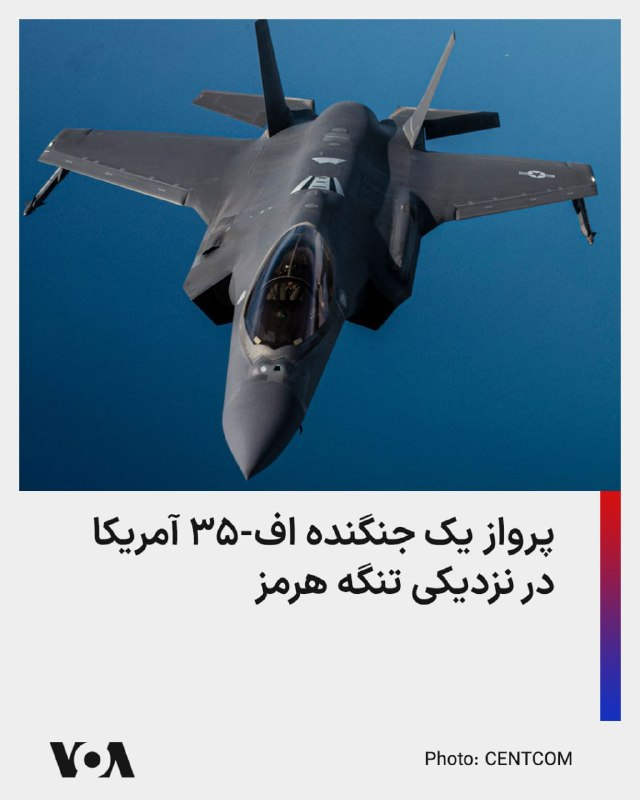

⚡️ستاد فرماندهی ایالات متحده آمریکا، روز چهارشنبه ۲۳ اردیبهشت با انتشار عکسی از گشت‌زنی یک جت جنگنده رادارگریز اف ۳۵ ای نیروی هوایی ایالات متحده بر فراز آب‌های منطقه‌ای نزدیک تنگه هرمز نوشت: «این جت می‌تواند تا ۱۸ هزار پوند مهمات را در حالی که با سرعت مافوق صوت پرواز می‌کند، حمل کند.»

## FarsiVOA — post 217642

  <a href="telegram/content/FarsiVOA_217642_1778695229.mp4" target="_blank">🎬 Download video</a>

ویدیوی کاخ سفید از ورود رئیس‌جمهوری آمریکا به چین؛

دونالد ترامپ، رئیس جمهوری آمریکا، روز چهارشنبه ۲۳ اردیبهشت وارد پکن شد.

او در بدو ورود، از سوی معاون رئیس‌جمهوری چین، همراه با گارد احترام نظامی و شعار «خوش آمدید» حدود ۳۰۰ نوجوان و جوان چینی که پرچم‌های آمریکا و چین را در دست داشتند مورد استقبال قرار گرفت.

این دومین دیدار رهبران دو اقتصاد بزرگ جهان از زمان ملاقات آنها در بوسان کره جنوبی در مهر سال گذشته خواهد بود.

نسخه اصلی این ویدیو با موسیقی متن منتشر شده است.

## FarsiVOA — post 217641

گزارش‌ها می‌گویند فدراسیون فوتبال جمهوری اسلامی همزمان با تنش‌های سیاسی و پرونده جام جهانی ۲۰۲۶، حالا با بحران مالی جدی هم روبه‌رو شده است.

## FarsiVOA — post 217640

اقدام یک پروژه آتلاین در انتشار نام و عکس مخالفان جمهوری اسلامی در خارج از کشور، با درخواست توقیف اموال، سلب تابعیت، و فشار قضایی علیه آنها نگرانی‌ها درباره سرکوب فرامرزی، پرونده‌سازی سیاسی، و تهدید خانواده مخالفان در ایران را افزایش داده است.

## FarsiVOA — post 217639

ترامپ: کار رسانه‌های منتشرکننده اخبار جعلی در ستایش از توان نظامی رژیم ایران «خیانت مجازی» است

## FarsiVOA — post 217638

  <a href="telegram/content/FarsiVOA_217638_1778695231.mp4" target="_blank">🎬 Download video</a>

فرماندهی مرکزی ایالات متحده، سنتکام، با انتشار این ویدیو از جمع‌بندی یک ماهه از محاصره دریایی علیه جمهوری اسلامی اعلام کرد تاکنون ۶۷ کشتی تجاری را مجبور به تغییر مسیر کرده، ‌به ۱۵ کشتی حاوی کمک‌های بشردوستانه اجازه عبور داده و ۴ کشتی را از کار انداخته است.
نسخه اصلی این ویدیو با موسیقی متن منتشر شده است.

## FarsiVOA — post 217637

🔺دیدار اسکات بسنت با معاون نخست‌وزیر چین در سئول در آستانه اجلاس سران دو کشور در پکن

▪️اسکات بسنت، وزیر خزانه‌داری ایالات متحده، روز چهارشنبه ۲۳ اردیبهشت در کره جنوبی با هه لی‌فنگ، معاون نخست‌وزیر چین، دیدار کرد تا زمینه را برای دیدارهای تاریخی پنج‌شنبه و جمعه بین دونالد ترامپ، رئیس‌ جمهوری آمریکا، و همتای چینی او شی جین‌پینگ، رئیس جمهوری چین، در پکن فراهم کند.

⬇️ بیشتر بخوانید:

https://ir.voanews.com/a/south-korea-bessent-china-visit-treasury-/8149568.html/?nocach=1

## DW_Farsi — post 124656

📸 پا به پای آخرین کوچ‌نشینان ایران

تصمیم‌های سیاسی و فشارهای اقتصادی، زندگی روزمره را بسیار فراتر از شهرهای ایران شکل می‌دهند.

در کوهستان‌های زاگرس، شمار اندکی از خانواده‌های بختیاری هنوز کوچ‌نشین‌اند؛ مهاجرتی فصلی که به شکل پیاده میان مراتع زمستانی پست و چراگاه‌های تابستانی در ارتفاع بیش از ۲۵۰۰ متری انجام می‌گیرد.

این سفر می‌تواند تا دو هفته طول بکشد و همچنان یکی از معدود مسیرهای کوچ‌نشینان در ایران است که هنوز هم کاملاً با پای پیاده طی می‌شود.

این شیوه زندگی روزبه‌روز شکننده‌تر و آسیب‌پذیرتر می‌شود. در حالی که کمبود آب، سدسازی و بارش‌های نامنظم، مسیرهای سنتی کوچ را پیش‌بینی‌ناپذیرتر کرده‌اند، افزایش هزینه‌ها و دسترسی محدود به خدمات، بسیاری از خانواده‌ها را به سوی اسکان و شهرنشینی سوق می‌دهد.

امروز تنها حدود یک تا دو درصد جمعیت ایران همچنان به سبک زندگی کوچ‌نشینی خود ادامه می‌دهند؛ در حالی که در گذشته این سهم بسیار بیشتر بود.
@dw_farsi

## DW_Farsi — post 124655

  

🔸 نسرین ستوده با قرار کفالت موقتا آزاد شد

مهرآوه خندان، فرزند نسرین ستوده، با انتشار پیامی خبر داد مادرش ساعاتی پیش به قید کفالت موقتا آزاد شده است. هنوز جزئیات بیشتری درباره مبلغ کفالت، شرایط آزادی و روند قضایی پرونده او منتشر نشده است.

این خبر در حالی منتشر شده که بازداشت نسرین ستوده با واکنش گسترده نهادهای حقوق بشری و چهره‌های مدافع آزادی‌های مدنی روبه‌رو شده بود.

آزادی او فعلا موقت است و به معنای بسته شدن پرونده قضایی‌اش نیست.
@dw_farsi

## DW_Farsi — post 124654

  

🔸 کایا کالاس: اتحادیه اروپا می‌تواند ماموریت دریایی خود را به تنگه هرمز گسترش دهد

کایا کالاس، مسئول سیاست خارجی اتحادیه اروپا، روز سه‌شنبه پس از نشست وزیران دفاع اتحادیه اروپا گفت ماموریت دریایی "آسپیدس" که اکنون از کشتیرانی در دریای سرخ حفاظت می‌کند، در صورت پایان جنگ ایران می‌تواند به تنگه هرمز هم گسترش یابد.

او گفت برخی کشورها وعده داده‌اند کشتی‌های بیشتری در اختیار این ماموریت بگذارند و همین موضوع می‌تواند در صورت تصمیم نهایی، اجرای آن را آسان‌تر کند.

کالاس گفت عملیات "آسپیدس" همین حالا هم نقش مهمی در حفاظت از کشتیرانی در دریای سرخ دارد، اما دامنه فعالیت آن می‌تواند به تنگه هرمز نیز برسد.

این موضع در حالی مطرح شده که وزیران دفاع اتحادیه اروپا در ماه مارس با مقاومت در برابر چنین پیشنهادی، از گسترش ماموریت استقبال نکرده بودند.
@dw_farsi

## Persian_Trend_Official — post 14071

  

🔴دفتر نخست وزیر اسرائیل :

💢در حين عملیات «غرش شیران»، نخست وزیر نتانیاهو مخفیانه از امارات متحده عربی بازدید و با شیخ محمد بن زاید، رئیس امارات متحده عربی دیدار کرد.

💢این دیدار منجر به یک پیشرفت تاریخی در روابط بین اسرائیل و امارات متحده عربی شد.

## Persian_Trend_Official — post 14070

  <a href="telegram/content/Persian_Trend_Official_14070_1778695234.webm" target="_blank">🎬 Download video</a>

https://youtube.com/live/xKXwDy6wYig?feature=share

## Persian_Trend_Official — post 14069

تا ده دقیقه دیکه لایو آغاز میشه

## Persian_Trend_Official — post 14068

🔴 رویترز مدعی حملات جنگنده‌های سعودی به مواضع گروه‌های عراقی شد

💢خبرگزاری رویترز به‌نقل از منابعی مدعی شد جنگنده‌های عربستان سعودی در جریان جنگ اخیر، مواضع گروه‌های مسلح عراقی را هدف قرار داده‌اند.

تاکنون نیز عربستان سعودی به‌صورت رسمی واکنشی به این ادعا نشان نداده است.

🫆:Tony

📌 @persian_trend_official
پرشین ترند | متفاوت‌ترین کانال نظامی

## Persian_Trend_Official — post 14067

  

🔴 عراقچی: کویت به یک قایق ایرانی حمله کرده و ۴ شهروند ایرانی را بازداشت کرده است

💢عباس عراقچی، وزیر خارجه ایران، اعلام کرد کویت در اقدامی «غیرقانونی» به یک قایق ایرانی در خلیج فارس حمله کرده و ۴ شهروند ایرانی را بازداشت کرده است.

او مدعی شد:

▪️ این اقدام با هدف ایجاد اختلاف و تنش در منطقه انجام شده است
▪️ حادثه در نزدیکی جزیره‌ای رخ داده که آمریکا از آن برای حمله به ایران استفاده کرده است
▪️ تهران خواستار آزادی فوری شهروندان بازداشت‌شده شده
▪️ ایران حق پاسخ‌گویی به این اقدام را برای خود محفوظ می‌داند

💢این اظهارات پس از آن مطرح می‌شود که کویت اعلام کرده ۴ فرد وابسته به سپاه پاسداران را هنگام ورود دریایی به جزیره بوبیان بازداشت کرده است؛ ادعایی که تهران آن را رد کرده و گفته ورود قایق به آب‌های کویت ناشی از اختلال در سامانه ناوبری بوده است.

🫆:Tony

📌 @persian_trend_official
پرشین ترند | متفاوت‌ترین کانال نظامی

## RadioFarda — post 157148

  

🔸دفتر نخست‌وزیر اسرائیل روز چهارشنبه اعلام کرد که بنیامین نتانیاهو در جریان جنگ آمریکا و اسرائیل با ایران، به‌طور «محرمانه» به امارات متحده عربی سفر کرده بود.

🔸در این بیانیه آمده که نتانیاهو با شیخ محمد بن زاید، رئیس امارات متحده عربی، دیدار کرد.

🔸دفتر نخست‌وزیر اسرائیل گفت: «این سفر به یک پیشرفت تاریخی در روابط میان اسرائیل و امارات متحده عربی منجر شد.»

🔸پیش‌تر مقام‌های ارشد آمریکایی تأیید کردند که اسرائیل در جریان جنگ با ایران، یک سامانه پدافندی «گنبد آهنین» به همراه نیروهایی برای بهره‌برداری از آن به امارات اعزام کرده است.

🔸همچنین به گفته مقام‌های عرب و یک منبع آگاه که با روزنامه وال‌استریت جورنال گفت‌وگو کردند، دیوید بارنئا، رئیس موساد، دست‌کم دو بار در طول جنگ با ایران به امارات سفر کرد تا دربارهٔ هماهنگی‌های مربوط به این درگیری رایزنی کند.

@RadioFarda

## RadioFarda — post 157147

  <a href="https://t.me/radiofarda/157147" target="_blank">📎 Download file</a>

🔸 در این کافه فردا به رواج پدیده دوست اجاره‌ای در ایران، گزارش گاردین در مورد اموال اسحاق قالیباف در استرالیا، توهین صدا و سیما به علی دایی، حواشی تمام نشدنی اینترنت پرو و سریال‌های مطرح و پر سر و صدای سوریه‌ای می‌پردازیم.

🔸 برای تماس با ما می‌توانید به شناسه کافه فردا در تلگرام صوت و متن بفرستید.

📻 کافه فردا

## RadioFarda — post 157146

  <a href="https://t.me/radiofarda/157146" target="_blank">📎 Download file</a>

📻بشنوید: ایستگاه ۱۹ با رادیوفردا، ۲۳ اردیبهشت ۱۴۰۵

@RadioFarda

## RadioFarda — post 157145

  <a href="https://t.me/radiofarda/157145" target="_blank">📎 Download file</a>

حسین احمدی‌نیاز: هیچ ضمانت قانونی برای بازگشت ایرانیان به کشور وجود ندارد

🔸قوه قضاییه جمهوری اسلامی روز ۲۳ اردیبهشت از اجرای یک حکم اعدام دیگر در ایران خبر داد. نام احسان افراشته ۳۳ ساله، متخصص شبکه و امنیت سایبری در حالی به فهرست بلند اعدام‌شدگان هفته‌های اخیر اضافه شد که دو منبع به رادیو فردا گفتند او پیش از بازگشت به ایران از ترکیه در اوايل سال ۱۴۰۳، به‌طور «داوطلبانه» خود را به نهادهای اطلاعاتی ایران معرفی کرده و تلاش یک سرویس امنیتی خارجی برای سوءاستفاده از خود را با آن‌ها در میان گذاشته بود. منابع رادیوفردا می‌گویند احسان افراشته در پی هماهنگی با وزارت اطلاعات تصمیم به بازگشت داوطلبانه به ایران می‌گیرد، اما پس از بازگشت بلافاصله در فرودگاه بازداشت، به انفرادی منتقل و در نهایت اعدام می‌شود. ارزیابی حسین احمدی‌نیاز حقوقدان ساکن هلند را بشنوید که به رادیوفردا می‌گوید عناصر مختلفی در پرونده وجود دارد که نشان می‌دهد حکم اعدام در پی یک دادرسی ناعادلانه صادر و اجرا شده است.

@RadioFarda

## RadioFarda — post 157144

  <a href="https://t.me/radiofarda/157144" target="_blank">📎 Download file</a>

ادامه قطع اینترنت در ایران و «انباشت خشم» در گفت‌وگو با اشکان خسروپور

🔸مسعود پزشکیان، رئیس‌جمهور ایران، محمدرضا عارف معاون اول خود را با حفظ سمت به عنوان رئیس «ستاد ویژه ساماندهی و راهبری فضای مجازی کشور» منصوب کرد. انتصابی که به نوشته مسعود پزشکیان در حکم انتصاب «نظر به ضرورت فوری استقرار حکمرانی یکپارچه، منسجم و کارآمد در فضای مجازی» صورت می‌گیرد. این انتصاب در شرایطی انجام شده که پزشکیان در ۷۴ روز اخیر به صورت مستقیم درباره دلایل قطع دسترسی به اینترنت با مردم ایران صحبت نکرده اما سخنگوی دولت او «امنیت» را دلیل قطع اینترنت عنوان کرده اگرچه که بسیاری از ناظران این حوزه می‌گویند این تنها یک توجیه است و حکومت از جنگ برای پیشبرد اهداف بلند‌مدت‌تر استفاده می‌کند. اشکان خسروپور پژوهشگر سیاست‌گذاری اینترنت به رادیوفردا می‌گوید سال‌هاست که محدودیت در اینترنت هدف و سیاست جمهوری اسلامی بوده است.

@RadioFarda

## RadioFarda — post 157143

  <a href="https://t.me/radiofarda/157143" target="_blank">📎 Download file</a>

آیا توان موشکی ایران پس از آتش‌بس احیا شده است؟ گفت‌وگو با فرزین ندیمی

🔸دونالد ترامپ، رئیس‌جمهور آمریکا، گزارش شماری از رسانه‌های غربی درباره عملکرد نظامی «خوب» ایران مقابل آمریکا را «خیانت» عنوان کرد و در شبکه اجتماعی خود، تروث‌سوشال، نوشت: «وقتی رسانه‌های جعلی می‌گویند که دشمن ایرانی از نظر نظامی در برابر ما عملکرد خوبی دارد، این عملاً خیانت محسوب می‌شود، چون چنین ادعایی کاملاً دروغ و حتی مضحک است». این موضع‌گیری پس از انتشار گزارش روزنامه نیویورک تایمز در روز ۲۲ اردیبهشت، مطرح شد. گزارشی که بر مبنای «ارزیابی‌های اطلاعاتی» می‌گفت «ایران همچنان به ۳۰ سکو از ۳۳ سکوی موشکی خود در حاشیه خلیج فارس دسترسی دارد» و حدود ۷۰ درصد از پرتابگرهای متحرک خود را در سراسر کشور مستقر کرده و تقریباً ۷۰ درصد از ذخایر موشکی پیش از جنگ خود را حفظ کرده است. توصیف کدامیک از طرفین به واقعیت نزدیک‌تر است؟ توان موشکی ایران در چه سطحی است و چه میزان از آن بعد از برقراری آتش‌بس احیا شده است؟ ارزیابی فرزین ندیمی، پژوهشگر ارشد در انستیتوی واشینگتن برای خاورنزدیک در آمریکا، را در این زمینه بشنوید.

@RadioFarda

## RadioFarda — post 157142

  <a href="https://t.me/radiofarda/157142" target="_blank">📎 Download file</a>

علی صدرزاده: رقابت‌های بین کشورهای خلیج فارس به سادگی از بین نمی‌رود

🔸خبرگزاری رویترز روز ۲۲ اردیبهشت در گزارشی اختصاصی به نقل از دو مقام غربی و دو مقام ایرانی اعلام کرد که در جریان جنگ اخیر، عربستان سعودی در واکنش به حملات تهران به این کشور، چندین حمله به اهدافی در ایران انجام داده بود. موضوعی که برای اولین بار رسانه‌ای می‌شود، اما مقام‌های عربستان سعودی به طور رسمی آن را تایید نکرده‌اند. این گزارش چند روز پس از آن منتشر می‌شود که روزنامه وال‌استریت جورنال به نقل از منابع آگاه، از «حملات نظامی» امارات متحده عربی به ایران در جریان جنگ خبر داده بود. بر اساس این گزارش، این حملات که امارات به‌صورت علنی آن‌ها را تأیید نکرده، شامل «حمله به یک پالایشگاه در جزیره لاوان» در خلیج فارس بوده است. آیا چنین اقدامات و واکنش‌هایی می‌تواند به شکل‌گیری رویکرد متحد میان این کشورهای عربی حوزه خلیج فارس در قبال ایران منجر شود؟ ارزیابی علی صدرزاده تحلیلگر خاورمیانه در آلمان را بشنوید

@RadioFarda

## IranianMinds — post 20083

  

🔴 عراقچی :

در تلاشی آشکار برای ایجاد اختلاف، کویت به ‌صورت غیرقانونی به یک قایق ایرانی در خلیج فارس حمله کرده و ۴ نفر از شهروندان ما را بازداشت کرده است. این اقدام غیرقانونی در نزدیکی جزیره ‌ای رخ داده که آمریکا از آن برای حمله به ایران استفاده میکند.

ما خواستار آزادی فوری شهروندان ‌مان هستیم و حق پاسخگویی را برای خود محفوظ می‌دانیم.

@IranianMinds

## IranianMinds — post 20082

  

🔴 برای هفتمین بار هم تلاش برای محدود کردن اختیارات جنگی ترامپ در مجلس سنای آمریکا شکست خورد !

@IranianMinds

## IranianMinds — post 20081

  

💙 خان وی‌پی‌ان
⚡️ سرعت بالا
🛡 پینگ و پایداری عالی
🔐 مناسب تلگرام، اینستا، یوتیوب، گیم و استریم
💸 قیمت اقتصادی با پلن‌های متنوع

🎁 تست ۵۰ مگ فقط ۷۵ تومن

🛎 کانال:

https://t.me/+qNjExGEJztE2OGI0

🤖 ربات خرید:
@Xan_vpn_bot

## IranianMinds — post 20080

  

🔴لبنان شکایتی رسمی به سازمان ملل ارائه داده است و ایران(جمهوری اسلامی) را به نقض کنوانسیون وین ۱۹۶۱ در مورد روابط دیپلماتیک متهم کرده است.
در این شکایت، ایران به دخالت مستقیم و آشکار در امور داخلی لبنان و کشاندن این کشور به جنگ متهم شده است.

@IranianMinds

## IranianMinds — post 20079

  <a href="telegram/content/IranianMinds_20079_1778695240.mp4" target="_blank">🎬 Download video</a>

🔴 اکانت اسرائیل به فارسی:

وقتی به زودی به اسرائیل سفر کنید، این منظره زیبا از پنجره هواپیما در انتظار شماست. به امید دیدار شما در تل‌آویو یا تهران.

@IranianMinds

## BBCPersian — post 280952

  

🔻دفتر بنیامین نتنانیاهو، نخست‌وزیر اسرائیل، اعلام کرده است که آقای نتانیاهو پیش از آتش‌بس و زمانی که جنگ با ایران در جریان بود به طور مخفیانه به امارات متحده عربی سفر کرد و با شیخ محد بن زاید، رئیس‌جمهور امارات، هم دیدار کرده است.

دفتر نخست وزیر اسرائیل در اطلاعیه‌ای اعلام کرده است: «این سفر منجر به یک پیشرفت تاریخی در روابط بین اسرائیل و امارات متحده عربی شده است.»

اخیرا روزنامه «اسرائیل هیوم» به نقل از سفیر آمریکا در سازمان ملل نوشت که اسرائیل در جریان جنگ اخیر، سامانه پدافند گنبد آهنین در اختیار امارات متحده عربی قرار داده است.

این روزنامه از مایک والتس، سفیر آمریکا در سازمان ملل، نقل کرد که «ما شاهد استفاده امارات از (سامانه) گنبد آهنین بودیم که اسرائیل در اختیار آنها قرار داده است.»

هفته پیش شدیدترین درگیری‌ها در تنگه هرمز و اطراف آن از زمان آغاز آتش‌بس یک ماه پیش به‌وقوع پیوست و امارات متحده عربی نیز روز جمعه بار دیگر هدف حمله قرار گرفت.

📷Getty Images

## BBCPersian — post 280951

🔻ترکیه می‌خواهد «چهار کشور خلیج فارس را به نشست ناتو دعوت کند»

یک رسانه ترکیه‌ای به همراه شبکه خبری بلومبرگ آمریکا گزارش داده ‌ند در حالی که موضوع جنگ ایران در در دستور کار نشست بعدی ناتو قرار دارد، ترکیه می‌خواهد چهار کشور حوزه خلیج فارس را به این نشست دعوت کند.

وب‌سایت انگلیسی‌زبان ترکیه تودی که روزنامه حامی دولت است اعلام کرده است که ترکیه امیدوار است قطر، کویت، امارات متحده عربی و بحرین را به نشست ناتو دعوت کند که قرار است از هفتم ژوئیه (۱۵ تیر) به مدت دو روز در آنکارا برگزار شود.

این چهار کشور در جریان حملات اسرائیل و آمریکا به ایران، هدف حملات متقابل نظامی جمهوری اسلامی ایران بودند.

در این گزارش، به نقل از منابع امنیتی آمده است که آنکارا در حال رایزنی با متحدان ناتو درباره دعوت از این کشورها به‌عنوان اعضای «ابتکار همکاری استانبول» است.

این گزارش می‌گوید که مشارکت اعضای این ائتلاف در نشست ناتو می‌تواند «فرصتی واقعی برای احیای سازوکاری باشد که مدت‌ها عملکرد ضعیفی داشته است».

همچنین گزارش شده است که منابع ترکیه‌ای هرگونه قصد آنکارا برای دعوت از احمد شرع، رئیس‌جمهور سوریه، به این نشست را رد کرده‌اند.
https://bbc.in/4uDhzre
@bbcpersian

## BBCPersian — post 280950

  <a href="https://t.me/bbcpersian/280950" target="_blank">📎 Download file</a>

پادکست رادیویی جام جهان‌نما چهارشنبه ۲۳ اردیبهشت ۱۴۰۵
در پی تحولات اخیر ایران و قطع و اختلال در اینترنت که امکان دسترسی مخاطبان در ایران به رسانه‌ها را با مشکل مواجه کرده است، بی‌بی‌سی فارسی از ۱۵ بهمن پخش رادیویی برنامه‌های خود را دوباره آغاز کرده است.

برنامه‌ جام جهان‌نما از این پس همه روزه از ساعت ۱۶:۳۰ گرینویچ (۲۰:۰۰ ایران) روی موج متوسط ۷۰۲ کیلوهرتز و موج کوتاه ۹۴۶۵ کیلوهرتز پخش می‌شود.

تکرار این برنامه از ساعت ۱۸:۰۰ گرینویچ (۲۱:۳۰ ایران) روی موج متوسط ۷۰۲ کیلوهرتز و موج کوتاه ۵۹۳۵ کیلوهرتز پخش می‌شود.
@bbcpersian

## BBCPersian — post 280949

.🔻«قیمت‌های عمده فروشی در آمریکا به بالاترین سطح از دسامبر ۲۰۲۲ تاکنون افزایش یافت»

به گفته اداره آمار کار آمریکا، قیمت‌های عمده‌فروشی در این کشور در ماه آوریل به‌شدت افزایش یافت.

این افزایش تحت تأثیر جهش هزینه‌های انرژی مرتبط با جنگ ایران رخ داد و بالاترین رشد ۱۲ ماهه در بیش از سه سال گذشته را ثبت کرد.

اداره آمار کار آمریکا امروز اعلام کرد شاخص قیمت تولیدکننده در ۱۲ ماه منتهی به آوریل به بالاترین سطح از دسامبر ۲۰۲۲ تاکنون افزایش یافت.

قیمت‌ها نسبت به ماه قبل نیز ۱/۴ درصد افزایش یافت که بسیار بالاتر از پیش‌بینی‌ها و بالاترین رشد از مارس ۲۰۲۲ است.

اقتصاد جهان از زمان همه‌گیری بیماری کرونا با تورم سرسختانه و صعودی مواجه بوده است و تعرفه‌های تجاری امضاشده توسط دونالد ترامپ، و همچنین جنگ آمریکا و اسرائیل با ایران فشار بیشتری بر قیمت‌ها وارد کرده‌اند.

https://bbc.in/4uGc0ID
@BBCPersian

## BBCPersian — post 280948

  <a href="telegram/content/BBCPersian_280948_1778695242.mp4" target="_blank">🎬 Download video</a>

🔻علیرضا ‌رئیسی، معاون وزیر بهداشت ایران در نشستی خبری امروز ۲۳ اردیبهشت در رابطه با احتمال ورود ویروس هانتا در ایران تاکید کرد که این ویروس «تاکنون مشاهده نشده است.»

شیوع ویروس هانتا، اوایل ماه مه در کشتی بزرگ تفریحی ام‌وی هاندی‌یوس که از آرژانتین به سمت قطب جنوب از مسیر اقیانوس اطلس در حرکت بوده، رخ داد.

معاون وزیر بهداشت با اشاره به این موضوع و بسته بودن تنگه هرمز احتمال ورود این ویروس به ایران از طریق مشابه را تقریبا محال دانست و به شوخی گفت: اگر حتی یک قایق بادی از این تنگه عبور کند در هوا می‌زنندش.»

سازمان جهانی بهداشت می‌گوید انتقال این ویروس از طریق انسان به انسان ممکن است، اما خطر گسترش عفونت در سطح جهانی همچنان پایین است.

آزمایش‌هایی برای تشخیص این عفونت وجود دارد، اما درمان اختصاصی برای آن وجود ندارد.
ادامه این گزارش را اینجا بخوانید.
@BBCPersian

## Dirty_Kids — post 389393

خمینی وقتی با فشار دولت صدام، مجبور به تَرک عراق شد، به سمت کویت رفت.
کویت او را راه نداد و آفتابه بدست در مرز عراق و کویت گرفتار شد.
چرا فرانسه رو انتخاب کرد؟
چون شهروندان ایرانی می‌توانستند بدون نیاز به ویزا تا "سه ماه" در فرانسه اقامت کنند.

@Dirty_Kids 👻

## Dirty_Kids — post 389392

  <a href="telegram/content/Dirty_Kids_389392_1778695243.mp4" target="_blank">🎬 Download video</a>

کپی برداری نوحه خوانی محمود کریمی از مدل اشعار برنامه های کودک تو سیرک شبانه حکومتی‌های حرامزاده؛

@Dirty_Kids 👻

## Dirty_Kids — post 389391

  <a href="telegram/content/Dirty_Kids_389391_1778695245.mp4" target="_blank">🎬 Download video</a>

بهمن محصص ۱۳ سال پیش گلشیفته رو اینجوری توصیف کرد...

چقد فحش خورد اون روزا

@Dirty_Kids 👻

## Dirty_Kids — post 389390

✖️ سایت بین المللی bet120x 
✖️  
👍دارای مجوز رسمی Gambling Judge سوئد
👍       
💳شارژ حساب از طریق ارز و یووچر و پرمیوم ووچر 
💳تسویه حساب دلاری سریع 💊بیمه شرط میکس 
⚠️فروش شرط 
🔔ویرایش شرط                    
3️⃣
2️⃣ 
🎁20%هدیه واریز از طریق ارز و ووچر ┅━━━━━━━━━━━…

## Dirty_Kids — post 389389

  

✖️ سایت بین المللی bet120x 
✖️

 
👍دارای مجوز رسمی Gambling Judge سوئد
👍
     

💳شارژ حساب از طریق ارز و یووچر و پرمیوم ووچر

💳تسویه حساب دلاری سریع
💊بیمه شرط میکس

⚠️فروش شرط

🔔ویرایش شرط                    
3️⃣
2️⃣

🎁20%هدیه واریز از طریق ارز و ووچر
┅━━━━━━━━━━━

🎁 10%برگشت باخت به صورت روزانه

🎁 10%برگشت باخت به صورت هفتگی

🎁10%برگشت باخت به صورت ماهانه

💻ادرس ورود به سایت:
https://bet120x.com/fa/?btag=971470
➖➖➖➖➖
   
👈 آموزش واریز و برداشت دلاری
👉

🔪کانال اطلاع رسانی:
👇

✈️https://t.me/+1Wv5nGY_a54xNzlk

## Dirty_Kids — post 389388

  <a href="telegram/content/Dirty_Kids_389388_1778695246.mp4" target="_blank">🎬 Download video</a>

و همچنان گلی در حال درخشیدنه

@Dirty_Kids 👻

## Dirty_Kids — post 389387

  

آلیس روزنبلوم ستاره اونلی فنز 2 میلیون دلار(360 میلیارد) از طرفدار درجه یکش دریافت کرد تا باهاش ملاقات کنه.

طرفداراش وقتی آلیس رو دیده گفته هر روز ۳ بار باهاش خودارضایی می‌کرده!
وقتی طرفدارش خواسته به بازوی آلیس دست بزنه، آلیس گفته به من دست نزن، تو خیلی چندش آوری! فورا از من دور شو وگرنه به پلیس زنگ میزنم.
اون جقی بدبختم ۳۶۰ میلیاردش بگا میره و دست از پا دراز تر برمیگرده خونه.

@Dirty_Kids 👻

## Hranews — post 112933

فقدان ایمنی کار؛ مرگ و مصدومیت ۸ کارگر ساختمانی در تبریز

❗️
❗️
❗️
❗️
❗️– در سایه فقدان ایمنی محیط و شرایط نامناسب کار، امروز چهارشنبه ۲۳ اردیبهشت ماه، هشت #کارگر_ساختمانی در تبریز به دنبال ریزش یک ساختمان در حال ساخت، دچار حادثه شدند. در این حادثه دو #کارگر جان باختند و شش تن دیگر مصدوم شدند.

ادامه مطلب

↘️
@hranews_bot تماس ✉️ -  @Hranews  کانال هرانا 🆑

## manototv — post 105410

  <a href="telegram/content/manototv_105410_1778695248.mp4" target="_blank">🎬 Download video</a>

عباس عراقچی، وزیر خارجه جمهوری‌اسلامی در شبکه اکس بازداشت چهار شهروند ایرانی در خلیج فارس توسط کویت را تایید کرد. عراقچی در اکس نوشته: «در تلاشی آشکار برای ایجاد اختلاف، کویت به‌طور غیرقانونی به یک قایق ایرانی حمله کرده و چهار تن از شهروندان ما را در خلیج فارس بازداشت کرده است. این اقدام غیرقانونی در نزدیکی جزیره‌ای رخ داد که آمریکا از آن برای حمله به ایران استفاده کرده بود. ما خواستار آزادی فوری شهروندان خود هستیم و حق پاسخ‌گویی را برای خود محفوظ می‌دانیم.» کویت دیروز اعلام کرده بود چهار عضو منتسب به سپاه قصد داشتند از راه دریا وارد کویت شوند و «اقدامات خصمانه» انجام دهند. وزارت کشور کویت اعلام کرد در درگیری با نیروهای امنیتی، یک نیروی کویتی زخمی شده و دو نفر از متهمان نیز فرار کرده‌اند. سفیر جمهوری‌اسلامی نیز در این کشور احضار و یادداشت اعتراضی رسمی به او تحویل داده شده بود.

## manototv — post 105409

  <a href="telegram/content/manototv_105409_1778695248.mp4" target="_blank">🎬 Download video</a>

شعبه اول دادگاه تجدیدنظر استان کهگیلویه و بویراحمد، فیض‌الله آذرنوش، پدر پدرام آذرنوش از جان‌باختگان اعتراضات ۱۴۰۱، به همراه سه شهروند دیگر این پرونده را در مجموع به ۳۰ سال حبس تعزیری محکوم کرد.

بر اساس حکم صادرشده، فیض‌الله آذرنوش با اتهام‌هایی از جمله «تشکیل گروه با هدف برهم زدن امنیت کشور»، «فعالیت تبلیغی علیه جمهوری اسلامی»، «توهین به رهبری» و «اجتماع و تبانی علیه امنیت کشور» در مجموع به ۱۵ سال زندان محکوم شده که پنج سال آن قابل اجراست.

همچنین میلاد کریمی‌نسب به شش سال زندان با پنج سال حبس قابل اجرا، امیرحسین محسنی‌پور به شش سال زندان با سه سال حبس قابل اجرا و مهدی کرمی به سه سال زندان محکوم شدند.

## manototv — post 105408

  <a href="telegram/content/manototv_105408_1778695249.mp4" target="_blank">🎬 Download video</a>

.
مقام‌های سوریه در ماه مارس «هلا منیر محمد» را به اتهام شکنجه و سوءاستفاده از زندانیان در دوران حکومت بشار اسد بازداشت کردند؛ زنی که به گفته زندانیان سابق، با نام «منیره» در زندان اطلاعات نیروی هوایی دمشق شناخته می‌شد و یکی از مخوف‌ترین نگهبانان این زندان بود.
بر اساس گزارش‌ها، هلا در ظاهر یک آرایشگر شناخته‌شده و مدرس زیبایی در دمشق بود، اما چندین زندانی سابق می‌گویند او در زندان المزّه با ضرب‌وشتم، تحقیر، توهین فرقه‌ای و شکنجه زنان زندانی شناخته می‌شد.
زندانیان سابق می‌گویند تنها صدای او برای ایجاد وحشت در سلول‌ها کافی بود. برخی روایت کرده‌اند او با لوله‌های پلاستیکی زندانیان را کتک می‌زد، موهای زنان را با خشونت می‌برید و هنگام آزار آن‌ها می‌خندید.
گزارش‌ها حاکی است هلا پس از سقوط حکومت اسد همچنان در دمشق زندگی می‌کرد و به‌عنوان آرایشگر فعالیت داشت تا اینکه گروهی از بازماندگان زندان با تحقیقات مستقل او را شناسایی و به مقام‌های جدید سوریه معرفی کردند.
خانواده و برخی آشنایان هلا اتهام‌ها را رد کرده‌اند و می‌گویند او «فقط یک زن جوان» بوده که دستورات مافوق‌ها را اجرا می‌کرده است. سازمان‌های حقوق بشری می‌گویند ده‌ها هزار نفر در دوران جنگ داخلی سوریه در زندان‌های حکومت اسد ناپدید یا کشته شده‌اند و زندان اطلاعات نیروی هوایی المزّه یکی از مراکز اصلی شکنجه و بازداشت بوده است.

## manototv — post 105407

  <a href="telegram/content/manototv_105407_1778695250.mp4" target="_blank">🎬 Download video</a>

تصاویری از استقبال از عباس عراقچی، وزیر خارجه جمهوری‌اسلامی در پایتخت هند، توسط رسانه‌های حکومتی منتشر شده است. بر پایه گزارش‌ها او برای شرکت در نشست وزرای خارجه بریکس وارد دهلی نو شده است.

## alonews — post 119797

  <a href="telegram/content/alonews_119797_1778695250.webm" target="_blank">🎬 Download video</a>

👈المانیتور: عربستان در زمان جنگ مخفیانه به ایران حمله کرده است

✅ @AloNews خبر جنگ

## alonews — post 119796

  <a href="telegram/content/alonews_119796_1778695251.webm" target="_blank">🎬 Download video</a>

👈به گزارش ان‌بی‌سی و به نقل از داده‌های ناوبری، چندین کشتی باری و نفتکش مرتبط با چین در ۲۴ ساعت گذشته از تنگه هرمز عبور کرده‌اند.

✅ @AloNews خبر جنگ

## alonews — post 119795

  <a href="telegram/content/alonews_119795_1778695251.mp4" target="_blank">🎬 Download video</a>

در دیسکوهای ایرانی دبی چه میگذرد

[@AloTweet]

## alonews — post 119794

اخبار جنگ الونیوز AloNews pinned «»

## alonews — post 119793

## alonews — post 119792

## alonews — post 119791

  <a href="telegram/content/alonews_119791_1778695253.webm" target="_blank">🎬 Download video</a>

👈وزیر خارجه عربستان: امنیت تنگه هرمز اساس ثبات اقتصاد جهانی است

✅ @AloNews خبر جنگ

## alonews — post 119790

  <a href="telegram/content/alonews_119790_1778695253.webm" target="_blank">🎬 Download video</a>

👈ادعای رویترز : منابع متعددی که از جزئیات ماجرا آگاه هستند، اعلام کردند که در جریان جنگ با ایران، جنگنده‌های عربستان سعودی اهدافی مرتبط با شبه‌نظامیان تحت حمایت تهران را در عراق بمباران کردند. بعلاوه، حملات تلافی‌جویانه‌ای نیز از کویت به داخل خاک عراق انجام شد

✅ @AloNews خبر جنگ

## alonews — post 119787

  <a href="telegram/content/alonews_119787_1778695253.webm" target="_blank">🎬 Download video</a>

👈سرباز اوکراینی با دوش پرتاب FN-16 چینی مشاهده شد

✅ @AloNews خبر جنگ

## alonews — post 119786

  <a href="telegram/content/alonews_119786_1778695253.webm" target="_blank">🎬 Download video</a>

👈هفتمین رأی‌گیری در سنا برای پایان جنگ علیه ایران شکست خورد 
✅ @AloNews خبر جنگ

## alonews — post 119785

  <a href="telegram/content/alonews_119785_1778695253.webm" target="_blank">🎬 Download video</a>

👈دفتر نخست‌وزیری اسرائیل: در میانهٔ جنگ اخیر، بنیامین نتانیاهو سفری مخفیانه به امارات متحدهٔ عربی داشته و با شیخ محمد بن زاید، رئیس‌ امارات، دیدار کرده است!

✅ @AloNews خبر جنگ

## alonews — post 119784

  <a href="telegram/content/alonews_119784_1778695253.webm" target="_blank">🎬 Download video</a>

👈هفتمین رأی‌گیری در سنا برای پایان جنگ علیه ایران شکست خورد

✅ @AloNews خبر جنگ

## alonews — post 119783

  <a href="telegram/content/alonews_119783_1778695253.webm" target="_blank">🎬 Download video</a>

👈عراقچی : کویت به‌صورت غیرقانونی به یه قایق ایرانی حمله کرده و ۴ تا از شهرامون رو تو خلیج فارس بازداشت کرده

🔴ما آزادی فوری‌شون رو می‌خوایم و حق پاسخ‌گویی هم برای خودمون محفوظ می‌دونیم

✅ @AloNews خبر جنگ

## alonews — post 119782

  <a href="telegram/content/alonews_119782_1778695254.webm" target="_blank">🎬 Download video</a>

👈اکونومیست: طولانی شدن بحران ایران می‌تواند آسیب جبران‌ناپذیری به کشورهای حاشیه خلیج‌ [فارس] وارد کند

✅ @AloNews خبر جنگ

## alonews — post 119781

  <a href="telegram/content/alonews_119781_1778695254.webm" target="_blank">🎬 Download video</a>

👈ارتش آمریکا به دلیل عوامل متعددی از جمله جنگ با ایران با کسری بودجه غیرمنتظره‌ای مواجه است، به طوری که ذخایر مهمات از سال ۲۰۲۲ به دلیل حمایت از اوکراین کاهش یافته و اکنون با درگیری ایران بیشتر تحت فشار قرار گرفته است، طبق گفته یک مقام آمریکایی که با الجزیره صحبت کرده است.

🔴 این مقام تأکید کرد که این کسری بر آمادگی رزمی تأثیر نخواهد گذاشت اما هشدار داد که در صورت عدم تصویب بودجه دفاعی ۱.۵ تریلیون دلاری، ممکن است تصمیمات سختی لازم باشد

✅ @AloNews خبر جنگ

## alonews — post 119780

  <a href="telegram/content/alonews_119780_1778695254.webm" target="_blank">🎬 Download video</a>

👈بلومبرگ: عربستان به اوپک اعلام کرد که تولید نفت خام این کشور در ماه آوریل ۶۵۱ هزار بشکه در روز  کاهش یافته و به پایین‌ترین سطح از سال ۱۹۹۰ در جریان جنگ خلیج فارس رسیده است

✅ @AloNews خبر جنگ

## alonews — post 119779

  <a href="telegram/content/alonews_119779_1778695254.webm" target="_blank">🎬 Download video</a>

👈با اعلام قوه قضاییه جمهوری اسلامی، احسان افرشته به اتهام «همکاری با اسرائیل»، بامداد چهارشنبه اعدام شد. 
✅ @AloNews خبر جنگ

## alonews — post 119778

  <a href="telegram/content/alonews_119778_1778695254.webm" target="_blank">🎬 Download video</a>

👈کریس رایت، وزیر انرژی آمریکا، می‌گوید ایران "به طرز ترسناکی نزدیک" به اورانیوم با درجه تسلیحاتی است — که در حال حاضر تا ۶۰٪ غنی‌سازی شده است، در حالی که برای ساخت سلاح هسته‌ای به ۹۰٪ نیاز است.

🔴او می‌گوید ایران ممکن است چند هفته تا رسیدن به این آستانه فاصله داشته باشد!

✅ @AloNews خبر جنگ

<!-- MSG END -->

<!-- NAV START -->

<!-- NAV END -->
